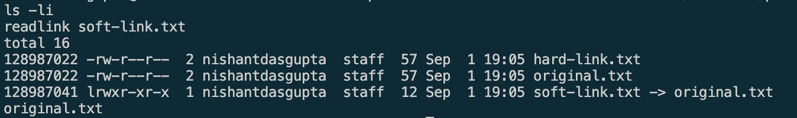

# Task 1: Soft Links and Hard Links

## Objective

Learn the difference between soft links and hard links, create both types, and
understand what happens when a link or its original pathname is deleted.

## Core Difference

| Property | Soft link (symbolic link) | Hard link |
| --- | --- | --- |
| What it stores | A pathname to another file | Another directory entry for the same inode |
| Inode | Different from the target | Same as the target |
| Can cross filesystems | Yes | No |
| Can link to directories | Yes | Normally not allowed for regular users |
| If the original pathname is deleted | Becomes a broken link | Continues to contain the data |
| Command | `ln -s TARGET LINK_NAME` | `ln TARGET LINK_NAME` |

## Practice Commands

Run these commands from this task directory:

```bash
cd practice

# Create a symbolic link.
ln -s original.txt soft-link.txt

# Create a hard link.
ln original.txt hard-link.txt

# Display inode numbers and link targets.
ls -li

# All three pathnames currently read the same data.
cat original.txt
cat soft-link.txt
cat hard-link.txt
```

Verified output from `ls -li`:

```text
128987022 -rw-r--r--  2 ... hard-link.txt
128987022 -rw-r--r--  2 ... original.txt
128987041 lrwxr-xr-x  1 ... soft-link.txt -> original.txt
```

`original.txt` and `hard-link.txt` share inode `128987022` and report two
hard links. `soft-link.txt` has a different inode and stores the pathname
`original.txt`.

## Deletion Practice

Deleting a link does not delete the target data:

```bash
rm soft-link.txt
rm hard-link.txt
cat original.txt
```

The links can then be recreated:

```bash
ln -s original.txt soft-link.txt
ln original.txt hard-link.txt
```

To demonstrate the most important behavioral difference safely, use a
temporary copy:

```bash
cp original.txt deletion-demo.txt
ln -s deletion-demo.txt deletion-demo-soft.txt
ln deletion-demo.txt deletion-demo-hard.txt
rm deletion-demo.txt

# Fails because the symbolic link points to the deleted pathname.
cat deletion-demo-soft.txt

# Still works because the hard link references the same inode and data.
cat deletion-demo-hard.txt

rm deletion-demo-soft.txt deletion-demo-hard.txt
```

A soft link is a separate file containing the pathname of its target. It has
its own inode, can cross filesystem boundaries, and becomes broken when its
target pathname is removed. A hard link is another name for the same inode and
data. It cannot normally cross filesystems or reference a directory. Removing
one hard-linked pathname does not remove the data while another hard link
still exists.

## Git 

Git records file content and symbolic-link targets, but it does not preserve
the shared inode relationship between hard links. After cloning a repository,
recreate the hard link with `ln original.txt hard-link.txt` before repeating
the inode demonstration.

## Useful Inspection Commands

```bash
ls -li
stat original.txt
readlink soft-link.txt
find . -samefile original.txt
```

## Evidence


