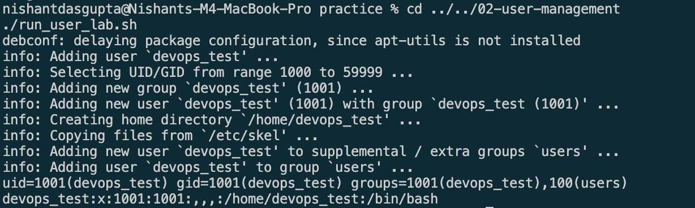

# Task 2: adduser vs useradd

## Difference

| `adduser` | `useradd` |
| --- | --- |
| Easy to use | Low-level command |
| Asks simple questions | Needs more options |
| Makes the home folder | May need `-m` |
| Best for Ubuntu users | Good for scripts |

Use `adduser` on Ubuntu for normal user setup.

## Commands

```bash
sudo adduser devops_test
id devops_test
getent passwd devops_test
```

Delete the test user after practice:

```bash
sudo deluser --remove-home devops_test
```

## Test Result


```text
Adding user `devops_test' ...
Creating home directory `/home/devops_test' ...
uid=1001(devops_test) gid=1001(devops_test) groups=1001(devops_test),100(users)
devops_test:x:1001:1001:,,,:/home/devops_test:/bin/bash
```

The container was removed after the test. No user was added to the host.

## Evidence


