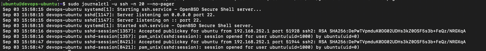

# Task 3: journalctl

`journalctl` reads logs made by `systemd`.

## Main Commands

```bash
# Show all logs.
journalctl

# Show logs from this boot.
journalctl -b

# Show the last 50 logs.
journalctl -n 50

# Follow new logs.
journalctl -f

# Show errors.
journalctl -p err

# Show logs for one service.
sudo journalctl -u ssh

# Show recent service logs.
sudo journalctl -u ssh --since today
```

On some Ubuntu systems, the service is named `sshd` instead of `ssh`:

```bash
sudo journalctl -u sshd
```


`journalctl` shows system and service logs. It can filter logs by boot, time,
level, or service.

## Note

This computer uses macOS, not `systemd`. Run these commands on Ubuntu to see
real journal logs.

## Evidence


