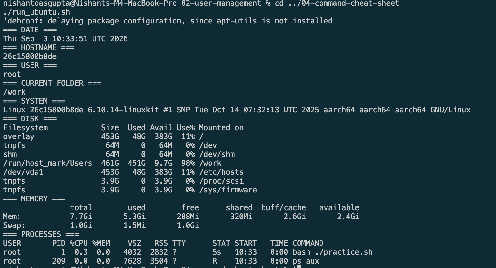

# Task 4: Linux Command Cheat Sheet

## Files

```bash
pwd                 # Current folder
ls -la              # List files
mkdir demo           # Make a folder
touch demo/file.txt  # Make a file
cp file1 file2       # Copy a file
mv file1 file2       # Move a file
rm file.txt          # Delete a file
cat file.txt         # Read a file
```

## System

```bash
date        # Date and time
hostname    # Computer name
whoami      # Current user
uname -a    # System details
df -h       # Disk use
free -h     # Memory use
ps aux      # Running tasks
```

## Search and Help

```bash
grep "word" file.txt
find . -name "*.txt"
man ls
ls --help
```

## Network

```bash
ip addr
ip route
ping -c 4 example.com
curl -I https://example.com
ss -tulpn
```

real output is saved in `output.txt`.

## Evidence


