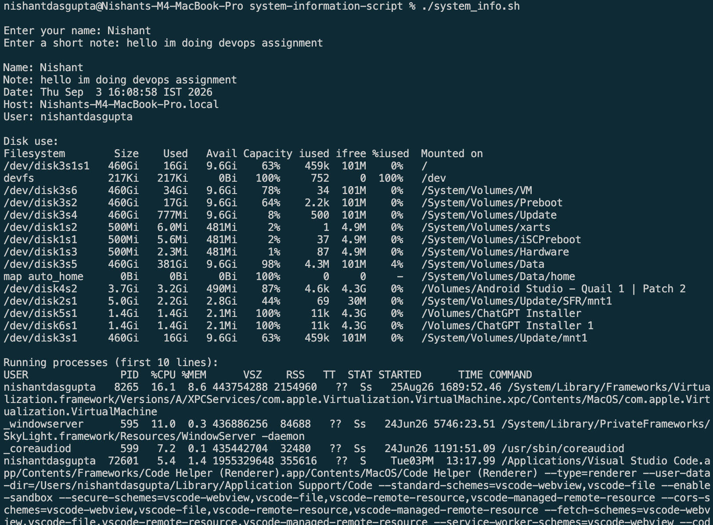
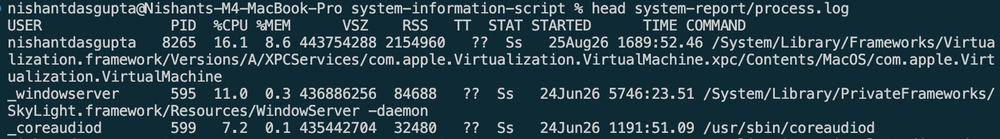

# System Information Script

This script shows system data and saves the process list.

Enter your name and a short note.

The script shows:

- Date
- Host name
- User name
- Disk use
- First 10 process lines

The full process list is saved in `system-report/process.log`.

## Recorded Output

```text
Name: Nishant
Note: hello im doing devops assignment
Date: Thu Sep 3 16:08:58 IST 2026
Host: Nishants-M4-MacBook-Pro.local
User: nishantdasgupta
Disk use: shown by df -h
Running processes: first 10 lines shown
Process list saved to: system-report/process.log
```

## Evidence




