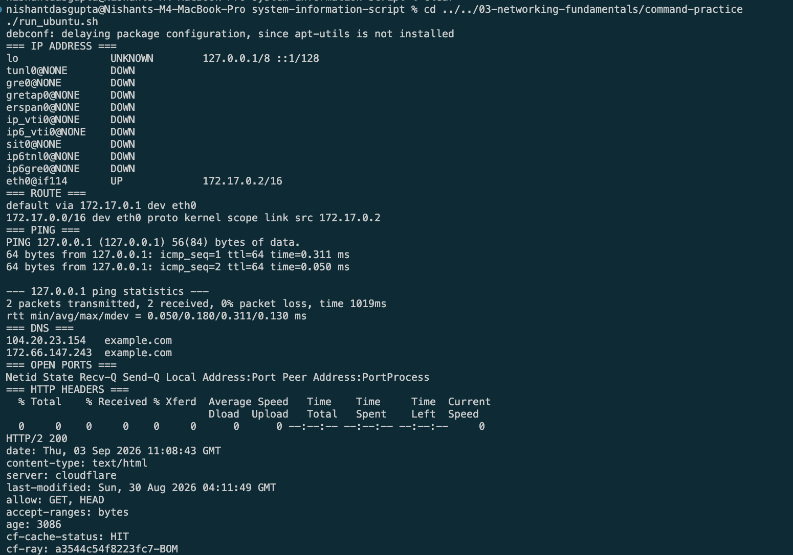

# Networking Commands

## Meaning

| Command | Use |
| --- | --- |
| `ip -brief addr` | Shows IP addresses. |
| `ip route` | Shows network routes. |
| `ping -c 2 127.0.0.1` | Tests the local network. |
| `getent hosts example.com` | Finds an IP from a name. |
| `ss -tuln` | Shows open ports. |
| `curl -I https://example.com` | Tests an HTTP server. |

The real Linux output is in `output.txt`.

## Result

```text
IP: 172.17.0.2/16
Default route: 172.17.0.1
Ping: 2 sent, 2 received, 0% loss
DNS: example.com resolved
HTTP: 200
```

## Evidence


