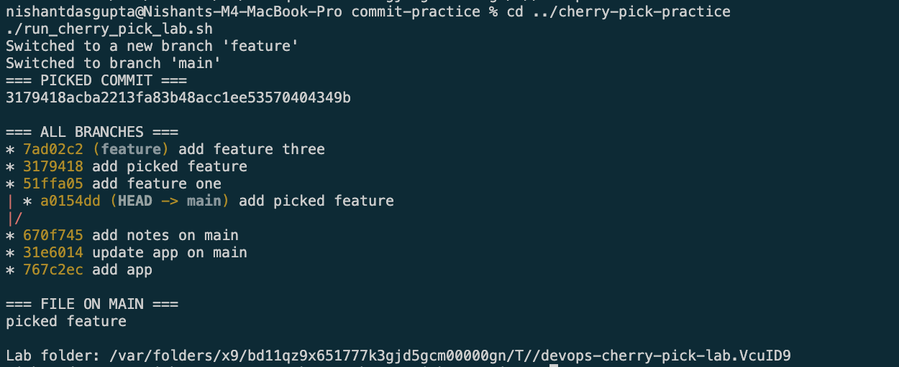

# Cherry-Pick Practice

`git cherry-pick` copies one commit to the current branch.

The script makes:

- Three commits on `main`
- Three commits on `feature`
- One cherry-pick from `feature` to `main`

It prints the branch graph and copied file.

## Result

The chosen `add picked feature` commit was copied to `main`. The other feature
commits stayed on the `feature` branch.

## Evidence

