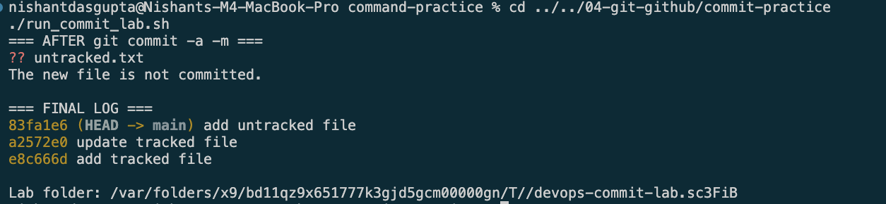

# Commit Practice

## Difference

- `git commit -m` commits staged files.
- `git commit -a -m` stages changed tracked files, then commits them.
- `-a` does not add new files.


## Result

```text
?? untracked.txt
The new file is not committed by git commit -a -m.
```

## Evidence


