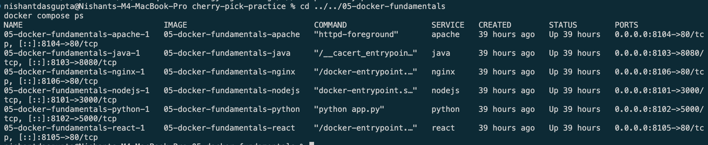
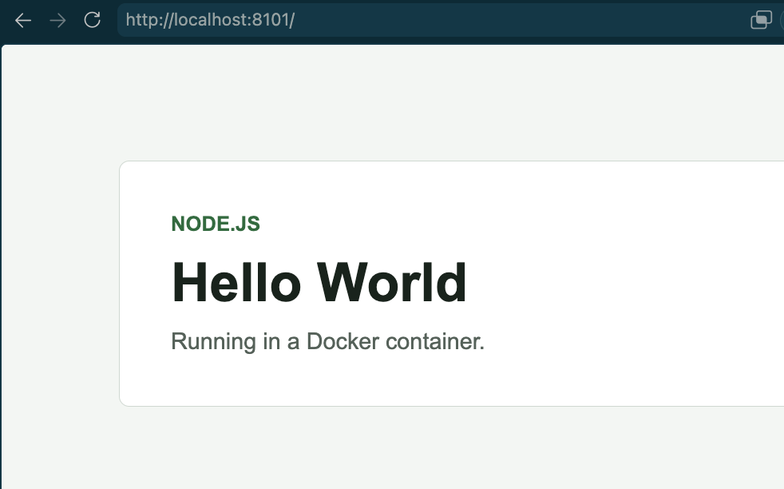
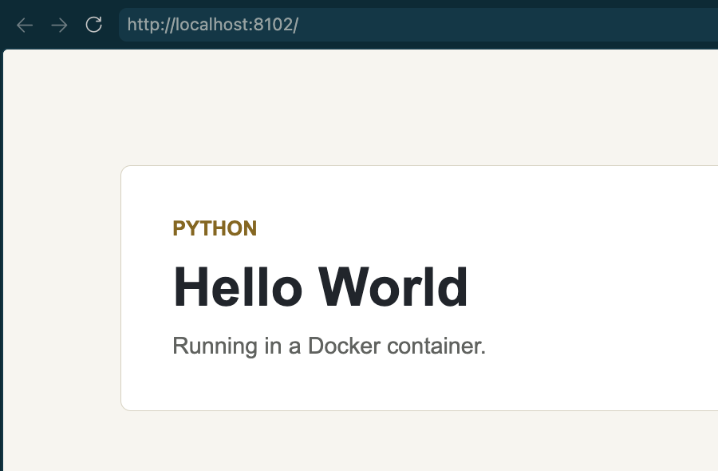
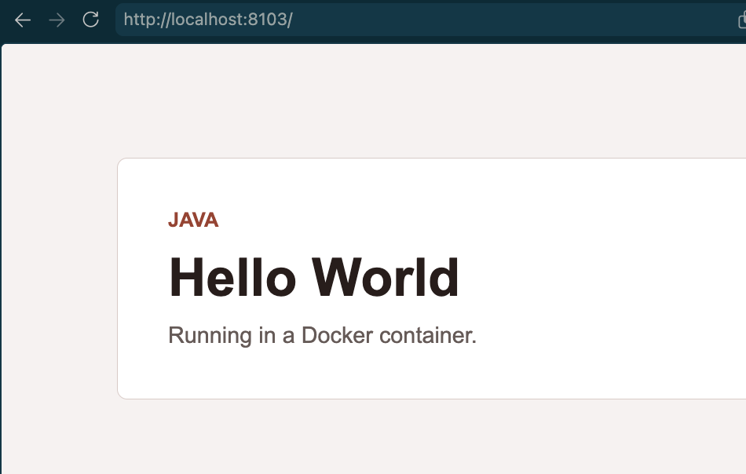
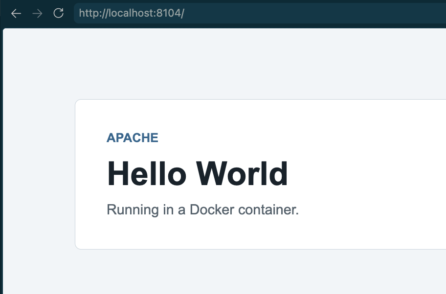
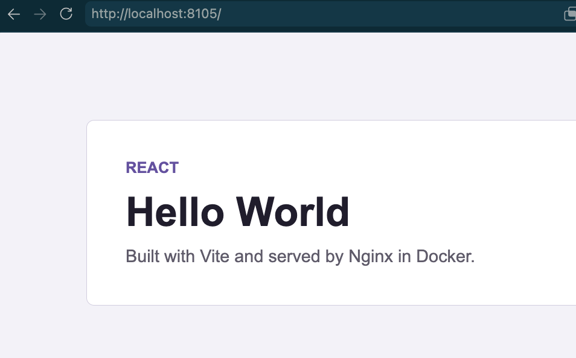
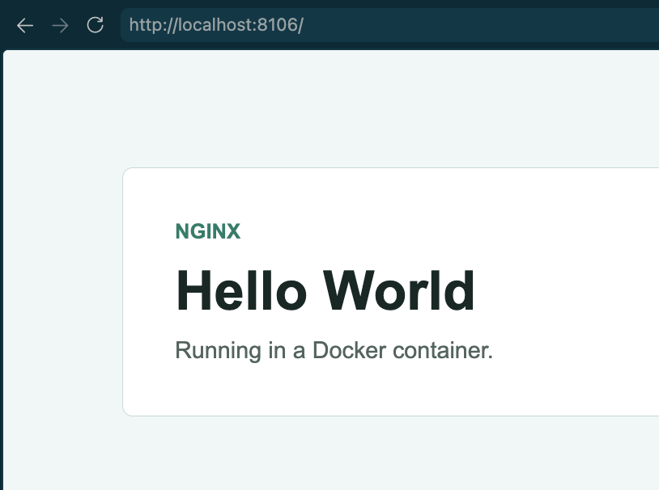

# Docker Hello World Apps

## Run All

```bash
docker compose up -d --build
docker compose ps
```

## Open

| App | URL |
| --- | --- |
| Node.js | http://localhost:8101 |
| Python | http://localhost:8102 |
| Java | http://localhost:8103 |
| Apache | http://localhost:8104 |
| React | http://localhost:8105 |
| Nginx | http://localhost:8106 |

## Stop

```bash
docker compose down
```

## Evidence

### Running Containers



### Applications












