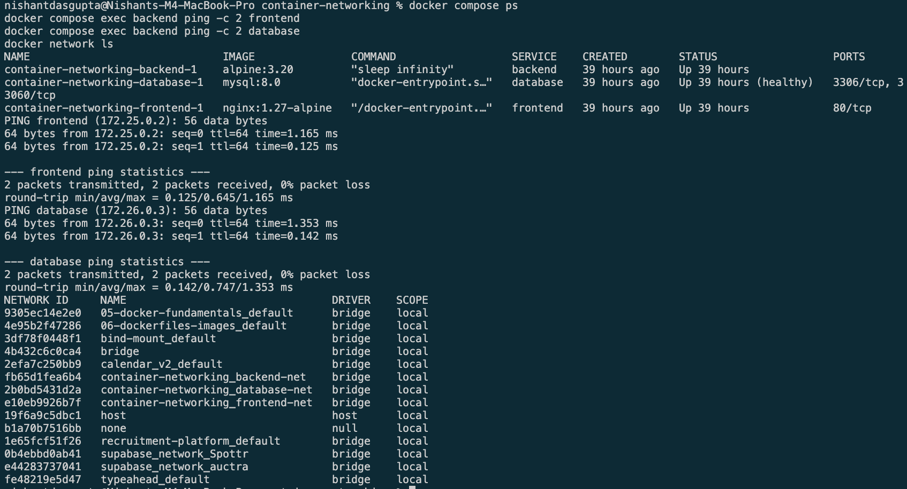
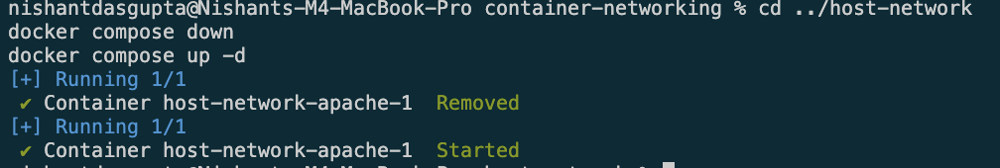
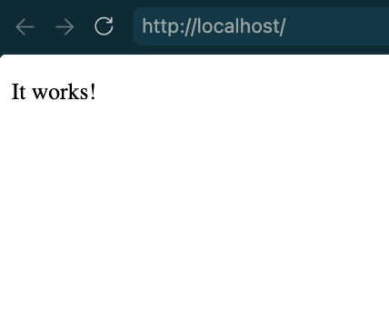
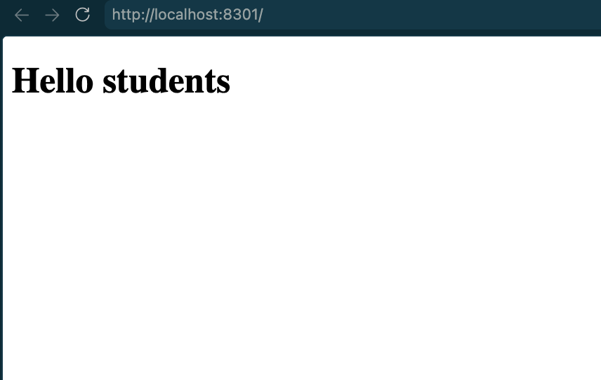
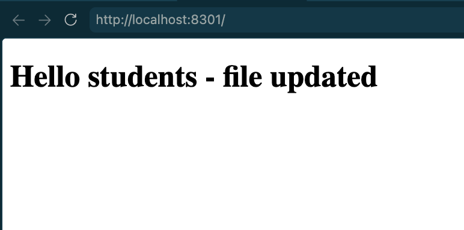

# Docker Networking and Volumes

Name: Nishant Dasgupta  
Roll number: **24bcs10451**

## Container Networking

The frontend, backend, and database use three Docker networks. The backend can
connect to both the frontend and database.

## Host Network

Apache uses the host network and is available on port `80`.

## Bind Mount

The page changes after editing the mounted `index.html` file. The container is
not restarted.

## Overlay Network

The overlay-network explanation and commands are in
[overlay-network/README.md](overlay-network/README.md).
