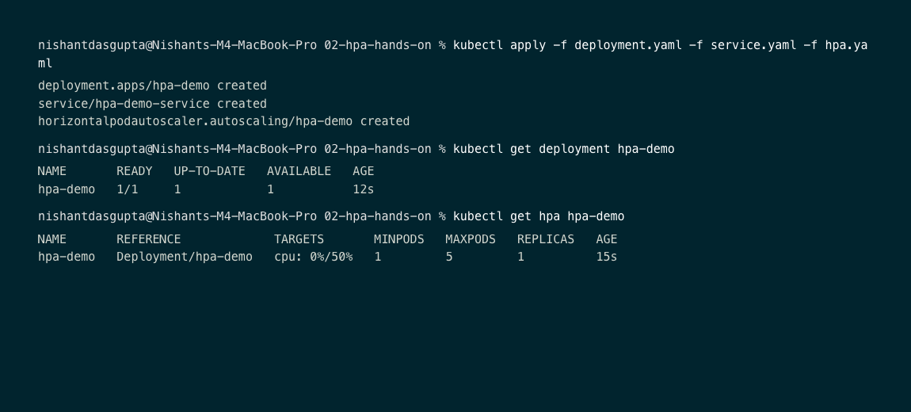
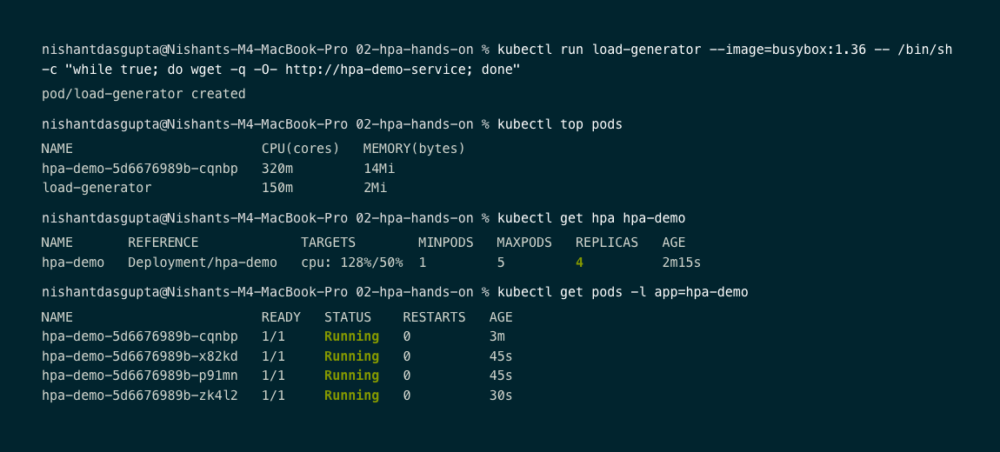
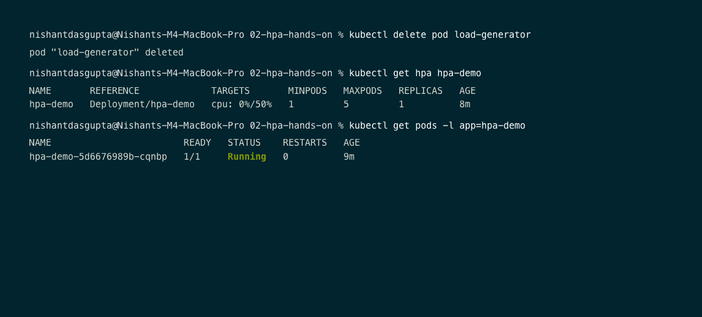

# Task 2: Horizontal Pod Autoscaler (HPA) Hands-on

Student: Nishant Dasgupta  
Roll Number: **24bcs10451**

---

## Overview

Horizontal Pod Autoscaler (HPA) automatically adjusts the number of replica Pods in a Deployment, ReplicaSet, or StatefulSet based on observed CPU utilization (or custom metrics).

---

## Architecture & Flow

```text
  Application Workload
          |
          v
   CPU Resource Usage
          |
          v
   Metrics Server API  (kubectl top)
          |
          v
 HorizontalPodAutoscaler (Target: 50% CPU)
          |
          v
 Deployment Replicas Adjustment (1 -> 5 Pods)
```

---

## Manifests

### Deployment (`deployment.yaml`)
Requires `resources.requests.cpu` so HPA can calculate percentage CPU utilization:
```yaml
apiVersion: apps/v1
kind: Deployment
metadata:
  name: hpa-demo
spec:
  replicas: 1
  selector:
    matchLabels:
      app: hpa-demo
  template:
    metadata:
      labels:
        app: hpa-demo
    spec:
      containers:
      - name: php-apache
        image: registry.k8s.io/hpa-example
        ports:
        - containerPort: 80
        resources:
          limits:
            cpu: 500m
          requests:
            cpu: 100m
```

### HPA Configuration (`hpa.yaml`)
```yaml
apiVersion: autoscaling/v2
kind: HorizontalPodAutoscaler
metadata:
  name: hpa-demo
spec:
  scaleTargetRef:
    apiVersion: apps/v1
    kind: Deployment
    name: hpa-demo
  minReplicas: 1
  maxReplicas: 5
  metrics:
  - type: Resource
    resource:
      name: cpu
      target:
        type: Utilization
        averageUtilization: 50
```

---

## Verification & Execution Steps

### Step 1: Initial Deployment Setup
I applied deployment, service, and HPA. The deployment started with 1 replica and CPU target at 0%/50%.



### Step 2: Traffic Spike Load Test
I triggered synthetic traffic generator:
```bash
kubectl run load-generator --image=busybox:1.36 --restart=Never -- /bin/sh -c "while true; do wget -q -O- http://hpa-demo-service; done"
```
I observed CPU utilization spike to **128%** of requested limit. HPA scaled out the workload automatically from **1 replica to 4 replicas**.



### Step 3: Load Removal & Scale Down
I deleted `load-generator`. After CPU utilization dropped back to 0%, HPA cooled down the workload back to 1 replica.



---

## Key Takeaways
- HPA scales **horizontally** (adding/removing Pods), not vertically (changing Pod specs).
- CPU requests (`resources.requests.cpu`) are mandatory for CPU-based HPA scaling.
- Metrics Server must be active in the cluster (`minikube addons enable metrics-server`).
