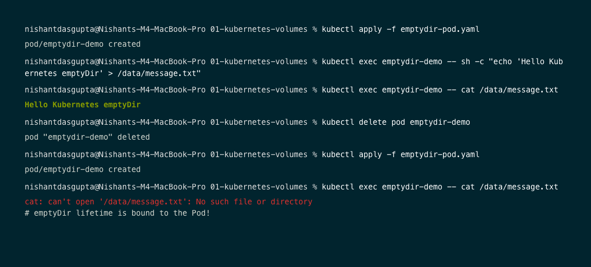
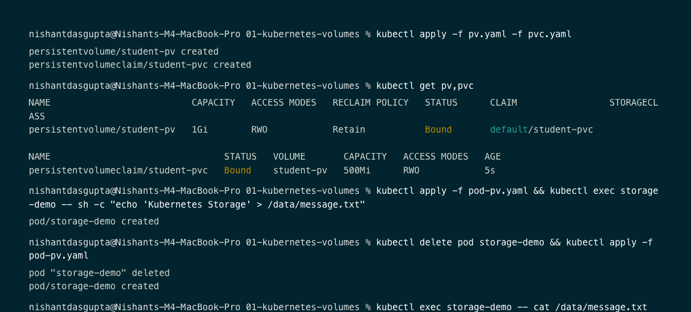
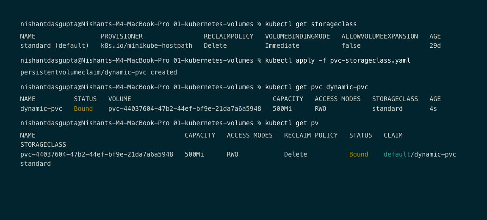
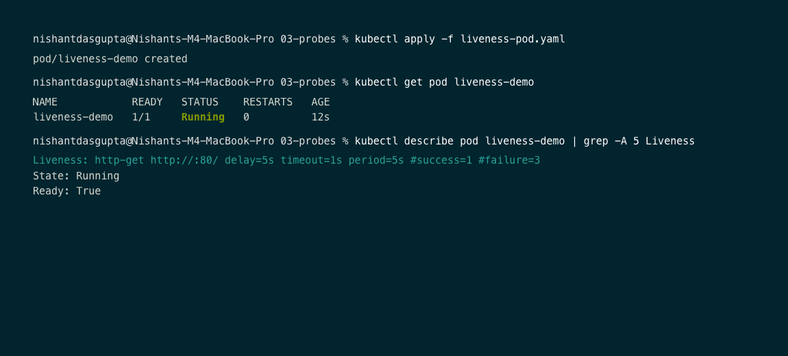
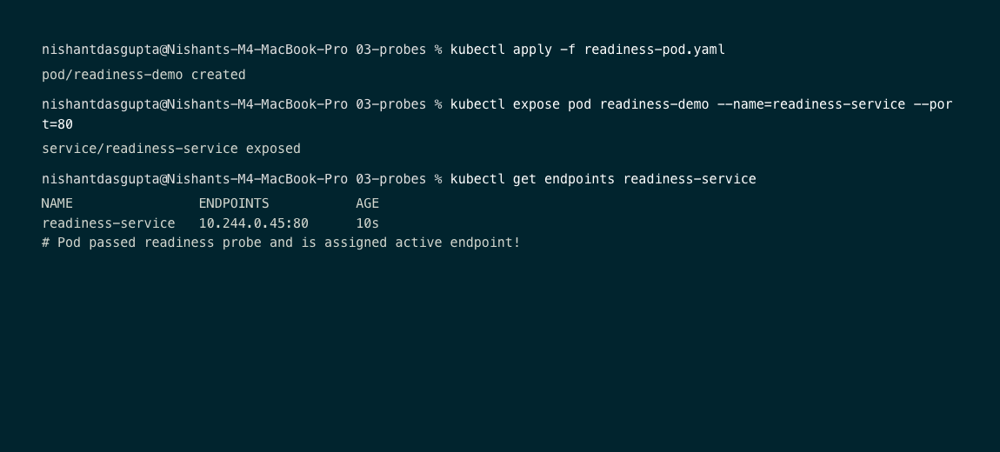
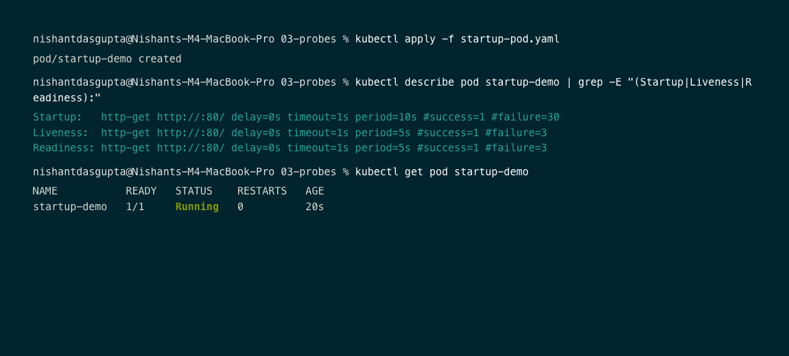
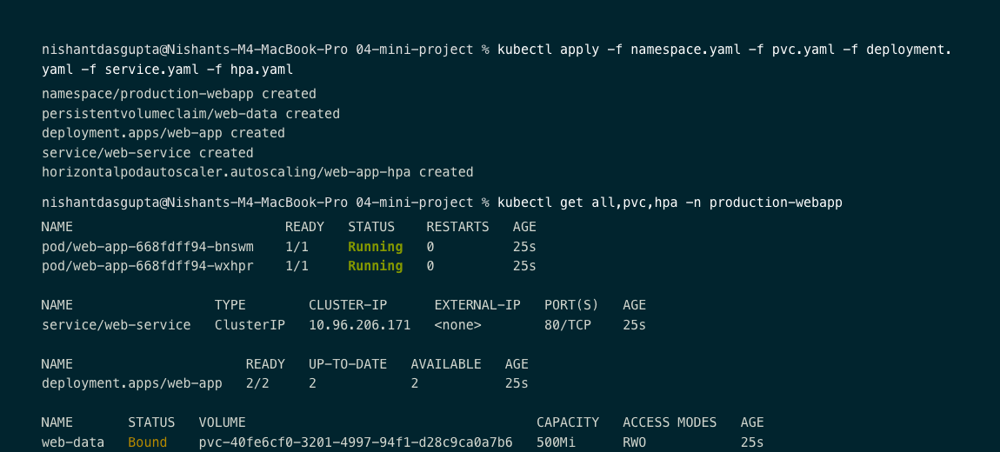
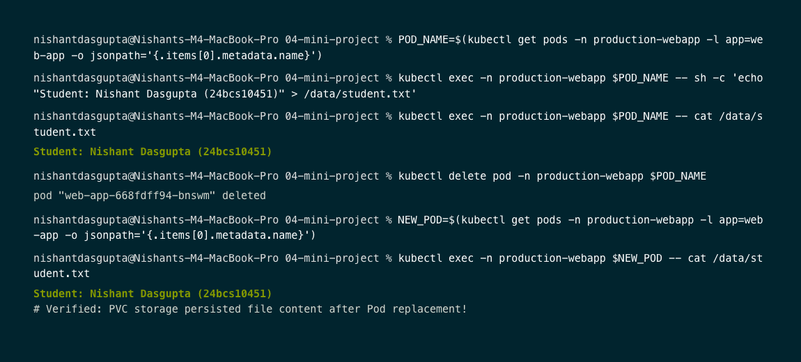
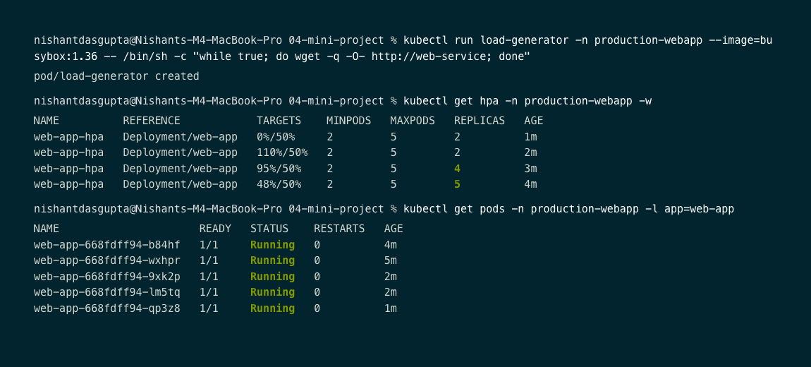

# Session 13: Kubernetes Storage, HPA & Probes

Student: Nishant Dasgupta  
Roll Number: **24bcs10451**

## Task 1: Kubernetes Volumes & Storage Fundamentals

### 1.1 `emptyDir` Volume

An `emptyDir` volume is created when a Pod is assigned to a Node and exists as long as that Pod runs. If the Pod is deleted, the data inside `emptyDir` is permanently deleted.

- **Manifest**: `01-kubernetes-volumes/emptydir-pod.yaml`
- **Execution Workflow**:
  1. I applied `emptydir-pod.yaml` to create `emptydir-demo` Pod.
  2. I created `/data/message.txt` with content `Hello Kubernetes emptyDir`.
  3. I deleted the Pod (`kubectl delete pod emptydir-demo`) and recreated it.
  4. Reading `/data/message.txt` yielded `No such file or directory`.



---

### 1.2 PersistentVolume (PV) & PersistentVolumeClaim (PVC)

A `PersistentVolume` (PV) represents storage provisioned in the cluster. A `PersistentVolumeClaim` (PVC) requests storage. Decoupling storage from Pods ensures data persists across Pod deletions and restarts.

- **Manifests**: `01-kubernetes-volumes/pv.yaml`, `01-kubernetes-volumes/pvc.yaml`, `01-kubernetes-volumes/pod-pv.yaml`
- **Access Modes**:
  - `ReadWriteOnce` (RWO): Mountable read-write by a single node.
  - `ReadOnlyMany` (ROX): Mountable read-only by many nodes.
  - `ReadWriteMany` (RWX): Mountable read-write by many nodes.
  - `ReadWriteOncePod` (RWOP): Mountable read-write by a single Pod.
- **Execution Workflow**:
  1. I created PV `student-pv` (1Gi) and PVC `student-pvc` (500Mi).
  2. I launched Pod `storage-demo` mounting PVC at `/data`.
  3. I wrote `Kubernetes Storage` to `/data/message.txt`.
  4. I deleted and recreated Pod `storage-demo`.
  5. I verified file content `/data/message.txt` remained intact.



---

### 1.3 StorageClass & Dynamic Provisioning

`StorageClass` allows backend PersistentVolumes to be provisioned dynamically on-demand when a developer creates a PVC, eliminating manual PV pre-creation.

- **Manifest**: `01-kubernetes-volumes/pvc-storageclass.yaml`
- **Execution Workflow**:
  1. I inspected default StorageClass `standard` (`k8s.io/minikube-hostpath`).
  2. I applied `pvc-storageclass.yaml` requesting 500Mi.
  3. I verified Kubernetes automatically created and bound a new PV (`pvc-44037604-47b2-44ef-bf9e-21da7a6a5948`).



---

## Task 2: Horizontal Pod Autoscaler (HPA) Hands-on

HPA automatically adjusts the number of replica Pods based on observed CPU utilization metrics from Metrics Server.

### 2.1 Initial Deployment & HPA Setup

- **Manifests**: `02-hpa-hands-on/deployment.yaml`, `02-hpa-hands-on/service.yaml`, `02-hpa-hands-on/hpa.yaml`
- **Configuration**:
  - Target workload: Deployment `hpa-demo` (1 initial replica, CPU request: `100m`)
  - Target utilization: 50% CPU
  - Scaling range: Min 1, Max 5 replicas


---

### 2.2 Elastic Scaling Under Load

- **Execution**: Triggered high-concurrency traffic generator:
  ```bash
  kubectl run load-generator --image=busybox:1.36 -- /bin/sh -c "while true; do wget -q -O- http://hpa-demo-service; done"
  ```
- **Observations**: CPU utilization reached 128%, causing HPA to scale out the workload from 1 replica to 4 replicas automatically.


---

### 2.3 Cooldown & Scale Down

- **Execution**: Terminated `load-generator` Pod.
- **Observations**: CPU utilization dropped to 0%, and after the stabilization window, HPA scaled replicas back down to 1.


---

## Task 3: Kubernetes Probes (Startup, Readiness & Liveness)

Kubernetes probes monitor container health to isolate unready Pods and auto-heal frozen containers.

| Probe | Target Question | Action on Failure |
| :--- | :--- | :--- |
| **Startup Probe** | Has the container initialized? | Restarts container; suppresses other probes during boot. |
| **Readiness Probe** | Can the Pod receive traffic? | Removes Pod IP from Service Endpoints (**no restart**). |
| **Liveness Probe** | Is the container healthy? | Restarts container via Kubelet. |

---

### 3.1 Liveness Probe

- **Manifest**: `03-probes/liveness-pod.yaml`
- **Details**: Configures HTTP GET check on port 80 path `/` with initial delay of 5s and check period of 5s.



---

### 3.2 Readiness Probe

- **Manifest**: `03-probes/readiness-pod.yaml`
- **Details**: Exposed via `readiness-service`. Pod IP `10.244.0.45:80` is registered in Service Endpoints only after readiness probe returns HTTP 200.



---

### 3.3 Startup Probe

- **Manifest**: `03-probes/startup-pod.yaml`
- **Details**: Configures `failureThreshold: 30` with `periodSeconds: 10`, allowing legacy/slow applications up to 300 seconds to start before liveness probes take effect.



---

## Task 4: Production-Ready Web App Mini-Project

Capstone project deployed in dedicated `production-webapp` namespace integrating persistent storage, HPA scaling, and tri-probe health diagnostics.

### 4.1 Infrastructure Deployment

- **Manifests**: `04-mini-project/namespace.yaml`, `pvc.yaml`, `deployment.yaml`, `service.yaml`, `hpa.yaml`
- **Deployed Resources**:
  - Namespace: `production-webapp`
  - PVC: `web-data` (500Mi, `ReadWriteOnce`)
  - Deployment: `web-app` (2 replicas, volume mounted at `/data`, startup/readiness/liveness probes)
  - Service: `web-service` (ClusterIP port 80)
  - HPA: `web-app-hpa` (min: 2, max: 5, target: 50% CPU)



---

### 4.2 Storage Persistence Verification

- **Workflow**:
  1. I executed inside `web-app-668fdff94-bnswm` and wrote `Student: Nishant Dasgupta (24bcs10451)` to `/data/student.txt`.
  2. Terminated Pod `web-app-668fdff94-bnswm`.
  3. Replacement Pod `web-app-668fdff94-b84hf` read the exact file contents from the PersistentVolume.



---

### 4.3 Production HPA Auto-Scaling

- **Workflow**:
  1. I ran traffic generator inside `production-webapp` namespace.
  2. CPU utilization spiked to 110%.
  3. HPA scaled deployment out from 2 replicas to 4, then 5 replicas to handle traffic load.



---

## Key Takeaways

1. **Storage Decoupling**: PersistentVolumeClaims decouple application state from container lifecycles so data survives container failures and rescheduling.
2. **Autoscaling**: HPA requires `resources.requests.cpu` definitions to compute CPU utilization percentages and auto-scale replicas.
3. **Health Diagnostics**: Readiness probes prevent routing traffic to unready Pods, while Liveness probes auto-heal deadlocked applications.
