# Session 14: Kubernetes Troubleshooting

Student: Nishant Dasgupta  
Roll number: **24bcs10451**
 
## Task 1: Kubernetes troubleshooting commands

| Command | What I learned and checked |
| --- | --- |
| `kubectl get pods` | Shows a quick overview of readiness, displayed status, restarts, and age. |
| `kubectl get pods -o wide` | Adds Pod IP and node information to help locate networking or scheduling failures. |
| `kubectl describe deployment troubleshooting-app` | Shows replicas, container image, selector, conditions, and Events. For failures, `describe pod <name>` shows container waiting/termination reasons. |
| `kubectl logs deployment/troubleshooting-app --tail=5` | Reads application stdout/stderr. Deployment log selection uses one matching Pod unless broader selection is requested. |
| `kubectl logs crash-demo --previous` | Requests logs from the previous container instance after a restart. Logs can be unavailable after runtime cleanup. |
| `kubectl exec deployment/troubleshooting-app -- sh -c 'curl -s localhost \| head -5'` | Runs a command inside the container and tests the application independently of the Service. |
| `kubectl events --types=Normal` | Displays Events for resources in the namespace. Warning Events explain failed scheduling, mounts, and image pulls. |
| `kubectl get events --field-selector involvedObject.name=<name>` | Filters Events to the failing Pod, reducing unrelated output. |
| `kubectl explain pod.spec.containers.image` | Reads the API field description and expected type. |
| `kubectl top pods` | Shows current CPU and memory measurements from Metrics Server. New Pods may initially have no metrics. |

Except `explain`, commands above use `-n homework-session14` in the recorded run.

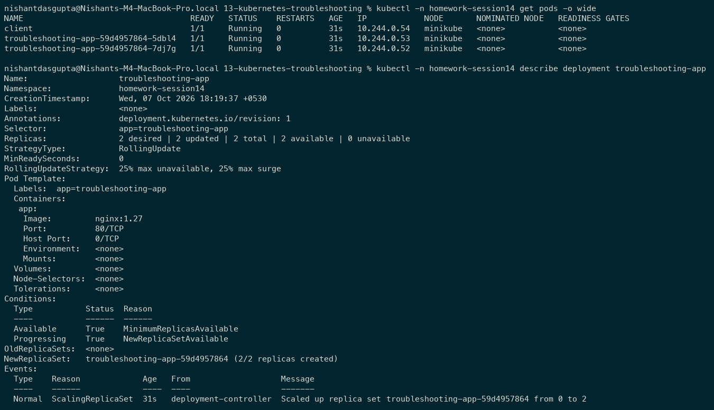

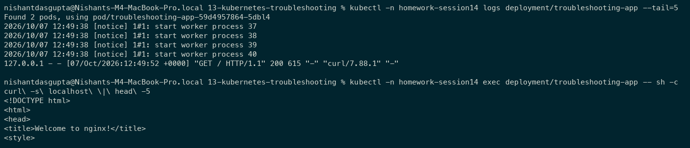

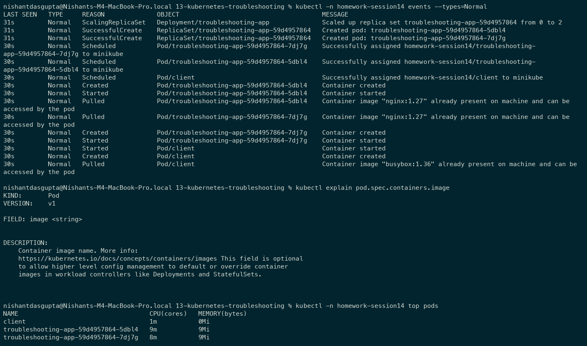

## Task 2: Troubleshoot common issues

For each issue I followed: **observe -> investigate -> identify root cause -> fix -> verify**. A Pod showing `Running` alone does not prove the application is reachable, so the connectivity cases also include requests from another Pod.

### 2.1 CrashLoopBackOff

- **Problem:** `crash-demo` repeatedly terminates instead of serving a workload.
- **Investigation:** I checked Pod status, current/previous logs, and Pod Events. `BackOff` Events confirm repeated container failures; status can alternate between `Error` and `CrashLoopBackOff` during retries.
- **Root cause:** The supplied command prints an error and executes `exit 1`. The default restart policy restarts it and Kubernetes increases the retry delay.
- **Fix:** I replaced the Pod using [crashloopbackoff-fixed-pod.yaml](02-common-issues/crashloopbackoff-fixed-pod.yaml), whose command stays alive with `sleep 3600`.
- **Verification:** Pod becomes `1/1 Running` with zero restarts and logs report `Application is healthy`. This lab demonstrates a corrected process lifetime; real applications must fix the underlying crash.

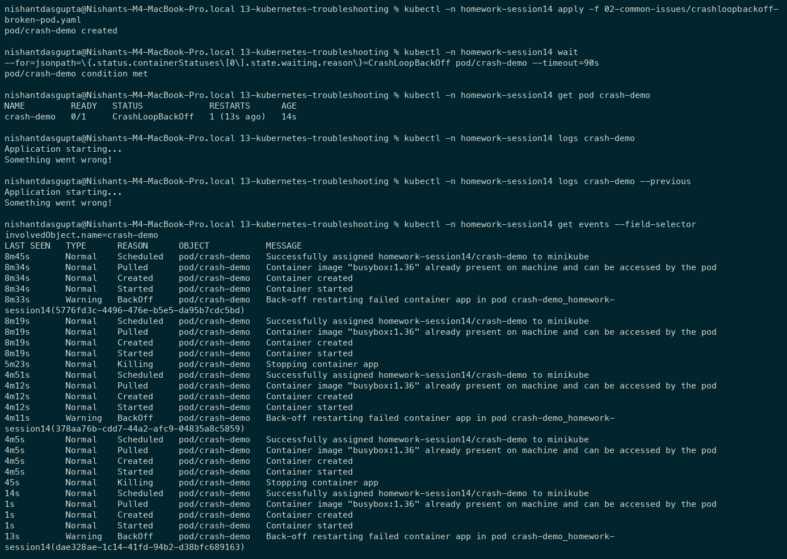

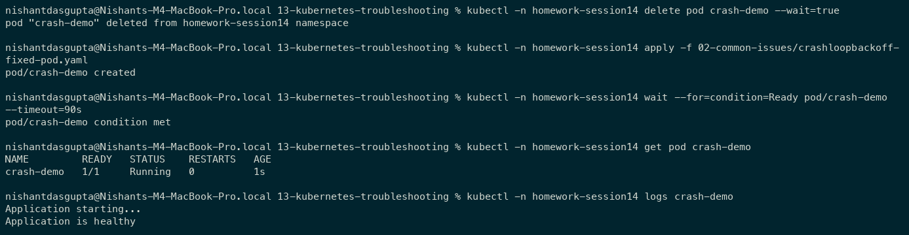

### 2.2 ErrImagePull and ImagePullBackOff

- **Problem:** `project-broken-pod` has no ready container and shows `ImagePullBackOff`.
- **Investigation:** I ran `get` and `describe` **before** changing the YAML. Events contain `ErrImagePull`, `ImagePullBackOff`, and a registry `not found` message.
- **Root cause:** `nginx:this-tag-does-not-exist` references a nonexistent image tag. `ErrImagePull` reports a failed pull attempt; `ImagePullBackOff` indicates retries are delayed.
- **Fix:** `kubectl -n homework-session14 set image pod/project-broken-pod app=nginx:1.27`.
- **Verification:** Waited for Ready, checked `1/1 Running`, and retrieved the NGINX welcome page inside the container.

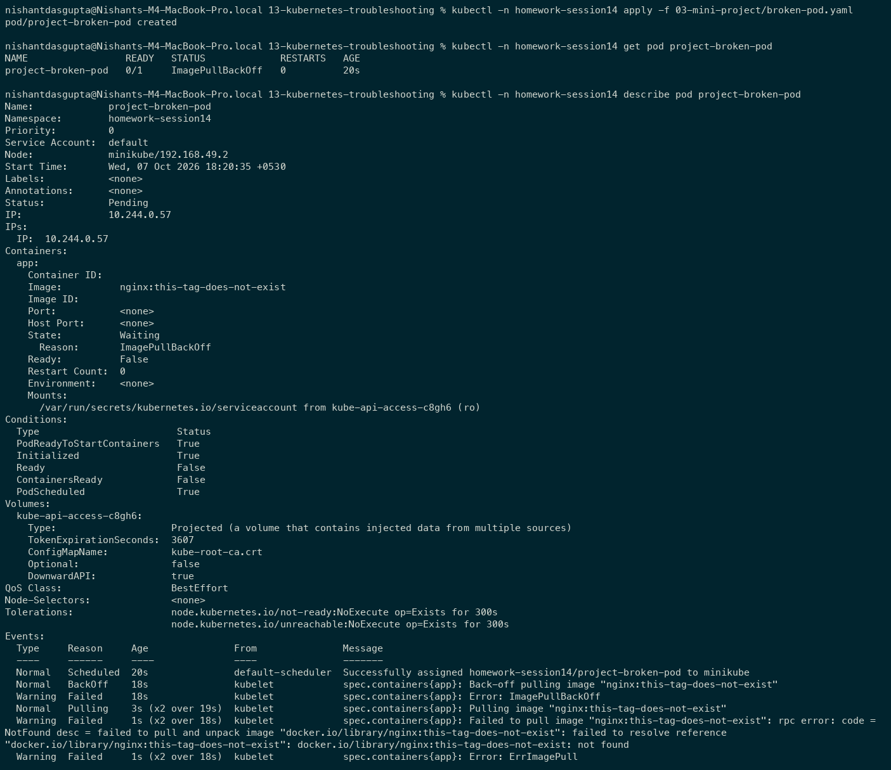

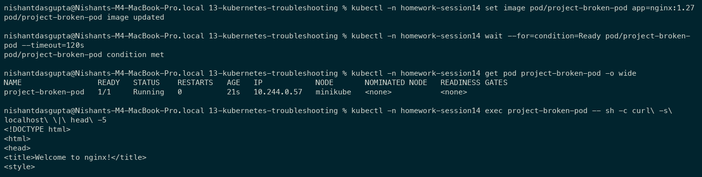

### 2.3 Pending

- **Problem:** `pending-demo` stays `Pending` with no assigned node or Pod IP.
- **Investigation:** I checked wide output, `FailedScheduling` Events, and node labels.
- **Root cause:** The Pod requests `kubernetes.io/hostname: node-that-does-not-exist`, but the available node is `minikube`.
- **Fix:** I replaced it using [pending-pods-fixed-pod.yaml](02-common-issues/pending-pods-fixed-pod.yaml), removing the impossible selector.
- **Verification:** Pod is `1/1 Running`, assigned to `minikube`, with an allocated IP.

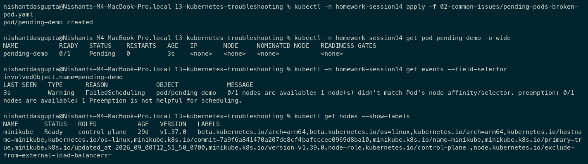

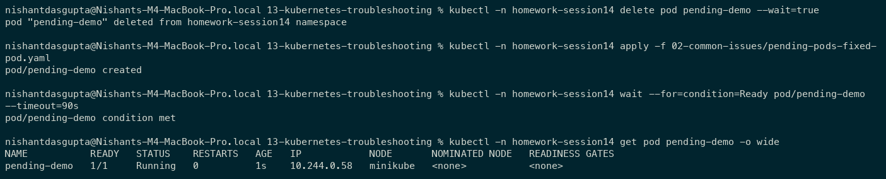

### 2.4 ContainerCreating

- **Problem:** `mount-demo` is stuck at `ContainerCreating`.
- **Investigation:** Events show `FailedMount` and identify the missing ConfigMap.
- **Root cause:** [mount-demo.yaml](02-common-issues/mount-demo.yaml) mounts a volume from `missing-config`, which does not exist.
- **Fix:** I created that ConfigMap with `--from-literal=message='Volume available'`.
- **Verification:** Pod becomes Ready and `cat /etc/lab/message` returns `Volume available`.

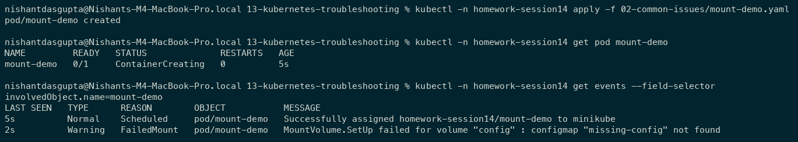

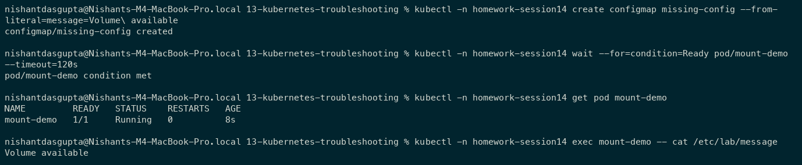

### 2.5 Configuration issue

- **Problem:** `config-demo` shows `CreateContainerConfigError`.
- **Investigation:** Events say `configmap "app-config" not found`; inspected the environment reference in [config-demo.yaml](02-common-issues/config-demo.yaml).
- **Root cause:** A required environment variable references an absent ConfigMap.
- **Fix:** I created `app-config` with `APP_MODE=homework` in the same namespace.
- **Verification:** Pod becomes Ready and `printenv APP_MODE` returns `homework`.

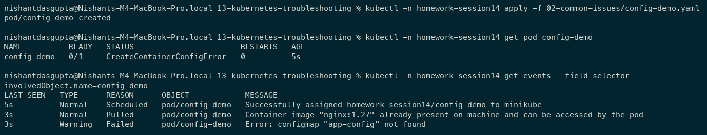

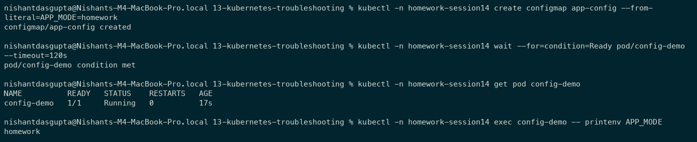

### 2.6 Service connectivity issue

- **Problem:** A request to `troubleshooting-service` fails even though the application Pods are ready.
- **Investigation:** I compared `get pods --show-labels` with `describe service`; checked EndpointSlices and attempted a request from `client`.
- **Root cause:** Service selector `app=wrong-app` matches no Pods. The application Pods have `app=troubleshooting-app`. The EndpointSlice has no backend addresses.
- **Fix:** Reapplied [service.yaml](03-mini-project/service.yaml) with the matching selector.
- **Verification:** EndpointSlice contains two Pod IPs on port 80 and a request from `client` returns the NGINX welcome page.

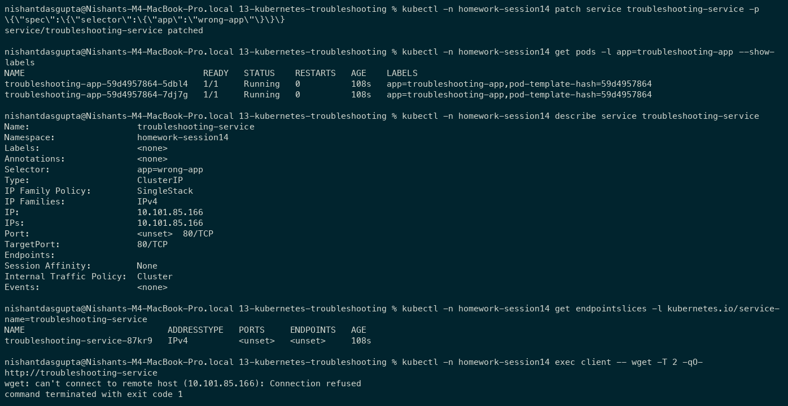

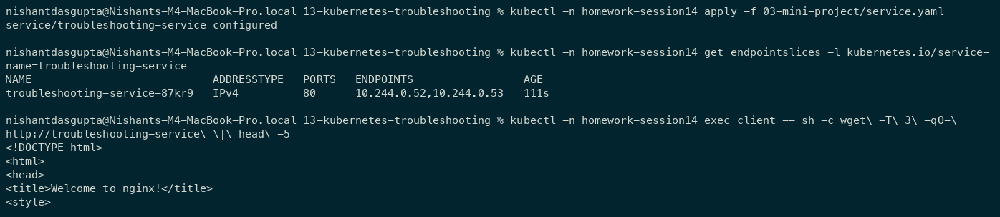

### 2.7 DNS issue

- **Problem:** `dns-client` cannot resolve the application Service.
- **Investigation:** I checked `/etc/resolv.conf`, attempted `nslookup`, and confirmed the CoreDNS Pod is running.
- **Root cause:** [dns-client.yaml](02-common-issues/dns-client.yaml) uses `dnsPolicy: None` and nameserver `203.0.113.1`, rather than Kubernetes cluster DNS. The recorded lookup returned `NXDOMAIN`.
- **Fix:** I recreated the client using the default `ClusterFirst` DNS policy.
- **Verification:** `/etc/resolv.conf` contains cluster search domains and DNS server `10.96.0.10`; the Service FQDN resolves to `10.101.85.166`.

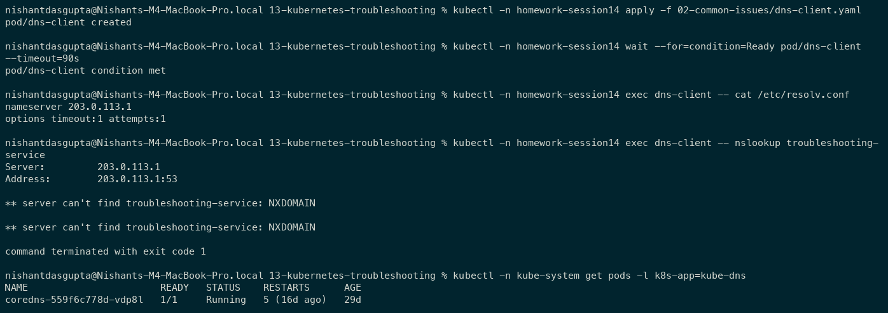

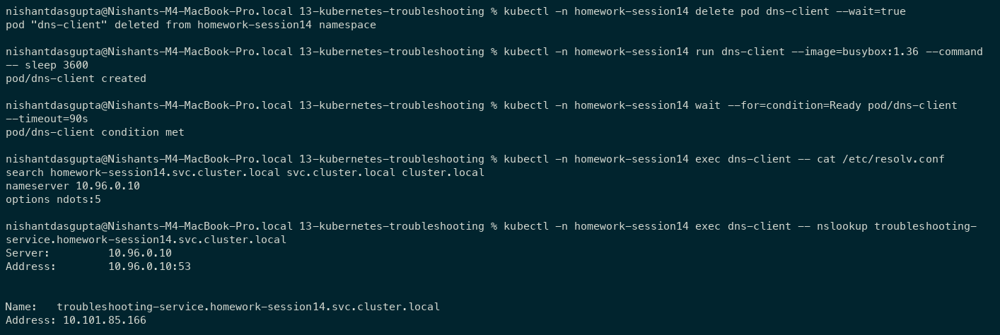

### 2.8 Pod networking issue

- **Problem:** `network-demo` responds to `curl localhost` inside its own container, but requests to its Pod IP from `client` fail.
- **Investigation:** I compared local and remote requests and read `/etc/nginx/conf.d/default.conf`.
- **Root cause:** NGINX listens only on `127.0.0.1:80`. The process is healthy but accepts connections only through its own loopback interface.
- **Fix:** I replaced the Pod with [network-demo-fixed.yaml](02-common-issues/network-demo-fixed.yaml), using `listen 80`. An initial in-place reload could not bind the wildcard address while the loopback listener still held the port, so replacing the Pod also released the old listener.
- **Verification:** The client receives `Session 14 network fixed` through the replacement Pod's IP.

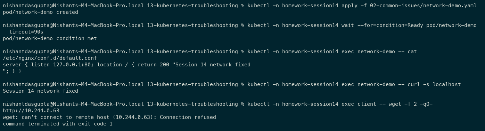

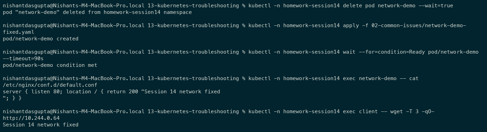

## Task 3: Kubernetes troubleshooting mini-project

I used the supplied [Deployment](03-mini-project/deployment.yaml), [Service](03-mini-project/service.yaml), and [broken Pod](03-mini-project/broken-pod.yaml). The application has two NGINX replicas selected by a ClusterIP Service.

```text
client Pod -> Service DNS -> ClusterIP:80 -> matching ready Pod:80 -> NGINX
                                            +-- replica 1
                                            +-- replica 2
```

1. I applied the Deployment and Service and waited for rollout completion.
2. I inspected wide output, Deployment details, application logs, and `curl localhost` inside a container.
3. I created the broken-image Pod, inspected its status and Events, then corrected the image and verified an HTTP response. See Task 2.2 for before/after evidence.
4. Deliberately changed the Service selector to `wrong-app`, compared labels and selector, observed missing backends, corrected the selector, and verified the Service from another Pod. See Task 2.6.
5. I verified the finished namespace, both Service backends, the application response, and CPU/memory metrics.

| Problem | What I saw | Command used | Root cause | Fix |
| --- | --- | --- | --- | --- |
| Broken Pod | `0/1 ImagePullBackOff` | `get pod`, `describe pod` | Container image could not be pulled | Set image to `nginx:1.27`, wait for Ready |
| Service problem | Ready Pods but no backend addresses; request refused | `describe service`, `get pods --show-labels`, `get endpointslices`, `exec client` | Selector did not match labels | Restore `app=troubleshooting-app` |
| Image problem | Events included `ErrImagePull` and registry `not found` | `describe pod project-broken-pod` | Nonexistent NGINX tag | Use the valid tag and confirm HTTP output |

### Broken-Pod answers

1. **Status:** `ImagePullBackOff`, with `0/1` ready containers. The Pod phase in `describe` is `Pending`; the displayed status includes its container waiting reason.
2. **Actual error:** Registry could not find `nginx:this-tag-does-not-exist`.
3. **Useful command:** `kubectl -n homework-session14 describe pod project-broken-pod`, especially its Events.
4. **Wrong image detail:** The tag does not exist.
5. **Fix:** Set the image to `nginx:1.27`, wait for readiness, and verify the NGINX response.

### Final verification

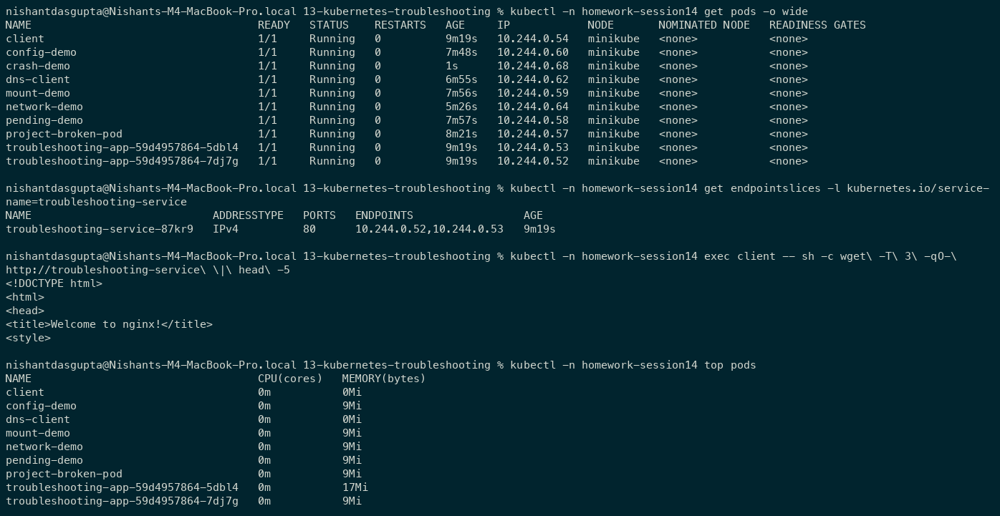


## What I learned

Events distinguish scheduler, image, and mount failures. Logs diagnose process failures. Testing localhost, Pod IP, Service IP, and DNS separately identifies which part of the request path is broken. Every fix needs a readiness check and, where appropriate, a real application request.
