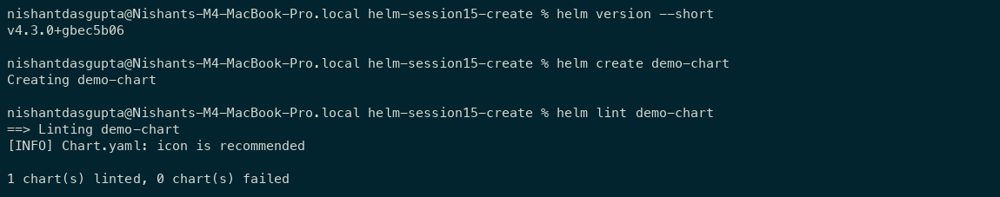
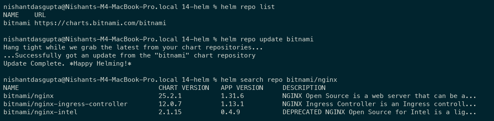
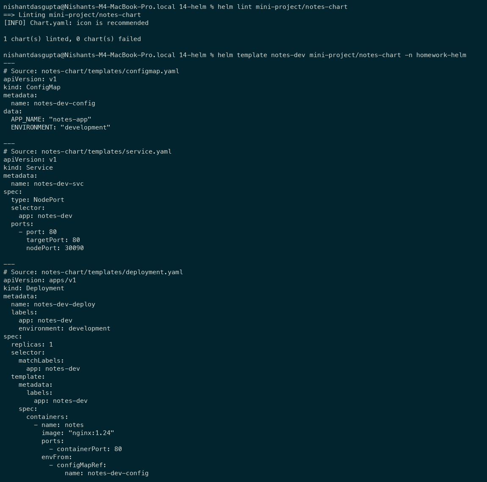
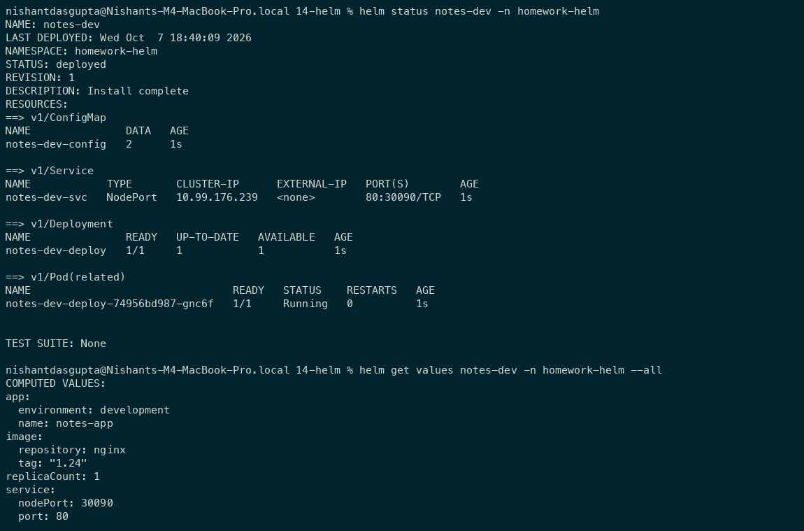
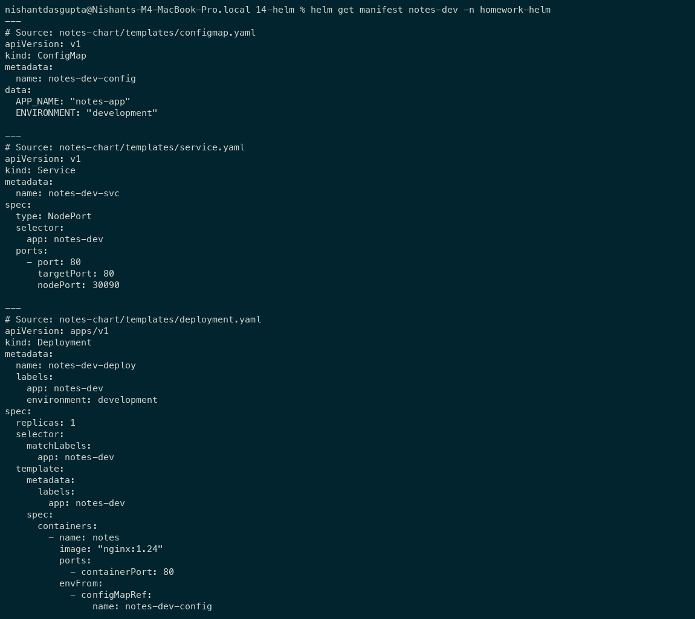
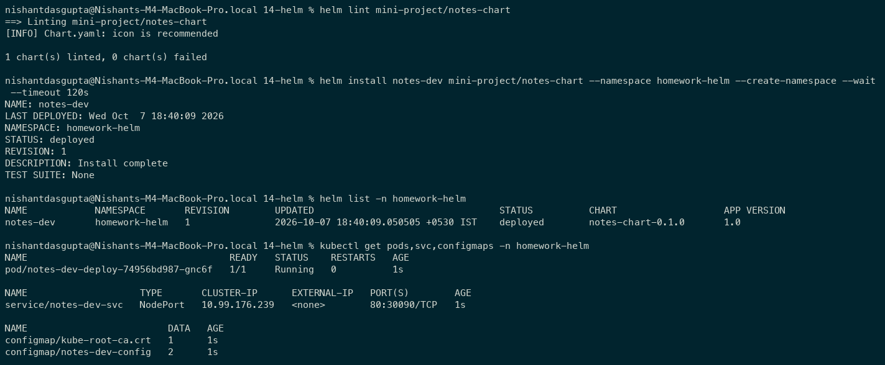
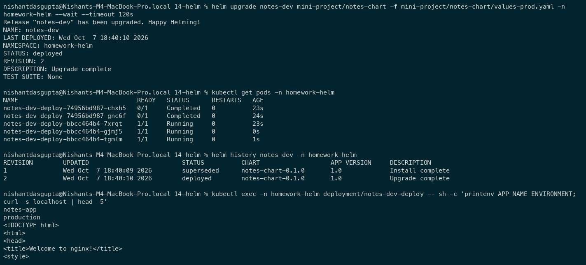
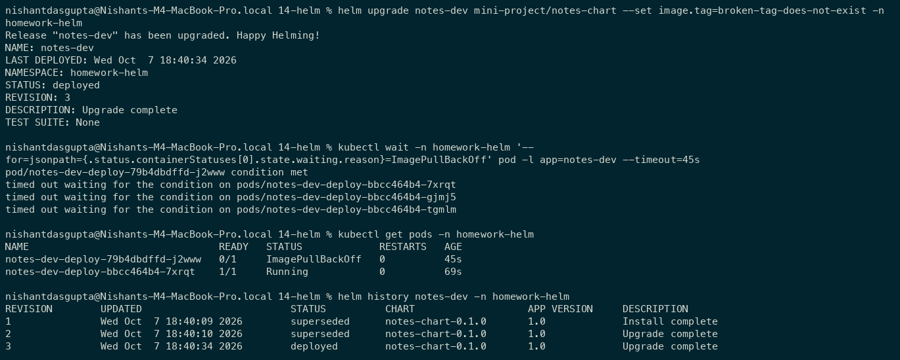
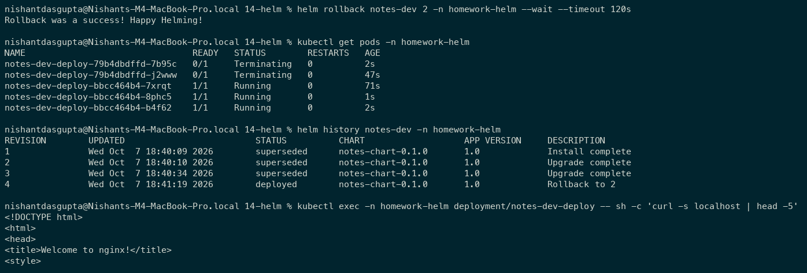
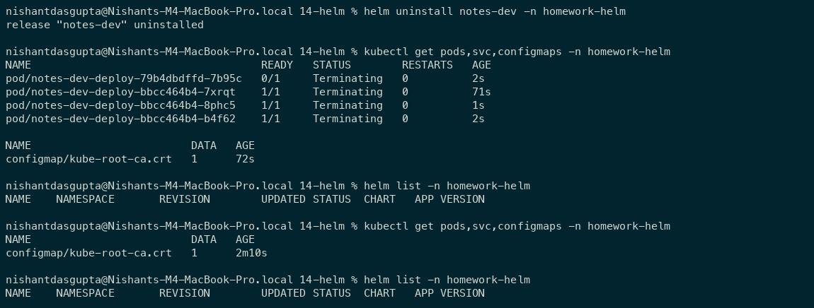

# Session 15: Helm

Student: Nishant Dasgupta  
Roll number: **24bcs10451**

## Task 1: Helm commands

### Create a chart

```bash
helm version --short
helm create demo-chart
helm lint demo-chart
```

`helm create` generates a chart skeleton; `helm lint` checks it for errors. The creation example ran in a temporary directory.



### Repositories and search

```bash
helm repo add bitnami https://charts.bitnami.com/bitnami
helm repo list
helm repo update bitnami
helm search repo bitnami/nginx
```

`helm repo` manages chart repositories and refreshes their indexes. `helm search repo` finds matching charts.



### Lint and render the supplied chart

```bash
helm lint mini-project/notes-chart
helm template notes-dev mini-project/notes-chart -n homework-helm
```

`helm lint` checks the chart; `helm template` previews its Kubernetes manifests without installing it.



### Install, list, inspect, update, and remove

| Command | What it does |
| --- | --- |
| `helm install` | Creates a release from a chart. |
| `helm list` | Lists releases in the selected namespace. |
| `helm status` | Displays release status, revision, and deployment details. |
| `helm get values --all` | Displays the effective release values, including chart defaults. |
| `helm get manifest` | Shows the Kubernetes manifests stored for the release. |
| `helm upgrade` | Creates a new release revision using new values. |
| `helm history` | Shows revisions and which revision is currently deployed. |
| `helm rollback` | Restores a previous revision's configuration as a new revision. |
| `helm uninstall` | Removes the release and its chart-managed resources. |

I inspected the installed release:

```bash
helm status notes-dev -n homework-helm
helm get values notes-dev -n homework-helm --all
helm get manifest notes-dev -n homework-helm
```





## Task 2: Complete rollback workflow

### 1. Install and verify

```bash
helm install notes-dev mini-project/notes-chart \
  --namespace homework-helm --create-namespace --wait --timeout 120s
helm list -n homework-helm
kubectl get pods,svc,configmaps -n homework-helm
```

Revision 1 created the development Deployment, Service, and ConfigMap successfully.



### 2. Upgrade and verify production values

```bash
helm upgrade notes-dev mini-project/notes-chart \
  -f mini-project/notes-chart/values-prod.yaml \
  -n homework-helm --wait --timeout 120s
kubectl get pods -n homework-helm
helm history notes-dev -n homework-helm
kubectl exec -n homework-helm deployment/notes-dev-deploy -- \
  sh -c 'printenv APP_NAME ENVIRONMENT; curl -s localhost | head -5'
```

Revision 2 used `nginx:1.25` with three ready replicas. Environment values and the NGINX response verified the upgrade.



### 3. Upgrade again and investigate the failure

```bash
helm upgrade notes-dev mini-project/notes-chart \
  --set image.tag=broken-tag-does-not-exist -n homework-helm
kubectl get pods -n homework-helm
helm history notes-dev -n homework-helm
```

Revision 3 produced `ImagePullBackOff` because the tag does not exist. Helm recorded the upgrade, but the new Pod was unhealthy.



### 4. Roll back and verify

```bash
helm rollback notes-dev 2 -n homework-helm --wait --timeout 120s
kubectl get pods -n homework-helm
helm history notes-dev -n homework-helm
kubectl exec -n homework-helm deployment/notes-dev-deploy -- \
  sh -c 'curl -s localhost | head -5'
```

Rollback restored revision 2 as revision 4. Three healthy replicas and a successful NGINX response verified recovery.



### 5. Uninstall verification

```bash
helm uninstall notes-dev -n homework-helm
kubectl get pods,svc,configmaps -n homework-helm
helm list -n homework-helm
```

Uninstall removed the release and application resources. Only the namespace's default CA ConfigMap remained.



## Task 3: Notes App mini-project

I completed the supplied Notes mini-project using its original chart files:

```text
mini-project/notes-chart/
+-- Chart.yaml
+-- values.yaml
+-- values-prod.yaml
+-- templates/
    +-- configmap.yaml
    +-- deployment.yaml
    +-- service.yaml
```

| File | Purpose |
| --- | --- |
| [Chart.yaml](mini-project/notes-chart/Chart.yaml) | Chart name, version, type, and application metadata. |
| [values.yaml](mini-project/notes-chart/values.yaml) | Development defaults: one replica, NGINX 1.24, development environment. |
| [values-prod.yaml](mini-project/notes-chart/values-prod.yaml) | Production overrides: three replicas, NGINX 1.25, production environment. |
| [templates/configmap.yaml](mini-project/notes-chart/templates/configmap.yaml) | Stores application name and environment. |
| [templates/deployment.yaml](mini-project/notes-chart/templates/deployment.yaml) | Creates the workload and injects the ConfigMap values. |
| [templates/service.yaml](mini-project/notes-chart/templates/service.yaml) | Exposes matching Pods through NodePort 30090. |

The supplied Notes app uses NGINX. Tasks 1 and 2 show its installation, upgrades, rollback, and uninstall.
