# Session 16: CI/CD & GitHub Actions

Student: Nishant Dasgupta  
Roll number: **24bcs10451**

## 1. Application

```bash
python3 -m venv /tmp/session16-venv
source /tmp/session16-venv/bin/activate
pip install -r requirements.txt
python app/calculator.py
```

A calculator supporting addition, subtraction, multiplication, and division.

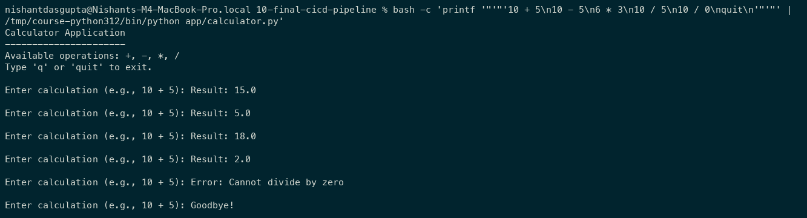

## 2. Tests

```bash
python -m pytest -v
```

All five supplied tests passed.

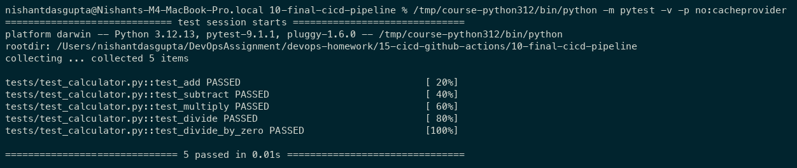

## 3. Build

```bash
bash build.sh
cat build/build-info.txt
```

Creates the `build/` directory uploaded as `calculator-build`.

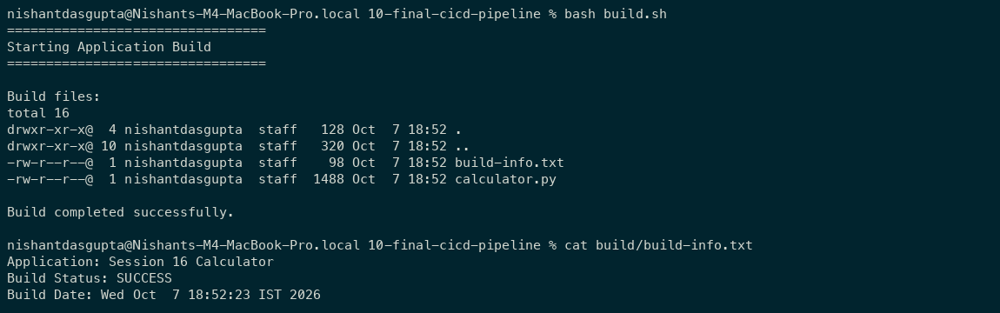

## 4. Security check

Checks for `.env`, `.pem`, and `.key` files; this is a basic filename check.

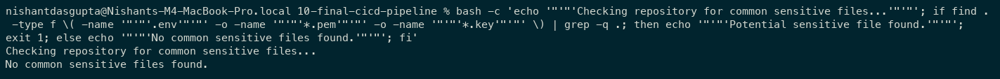

## 5. Failure and fix

In a temporary copy, incorrect addition failed one test. Restoring it passed all five.

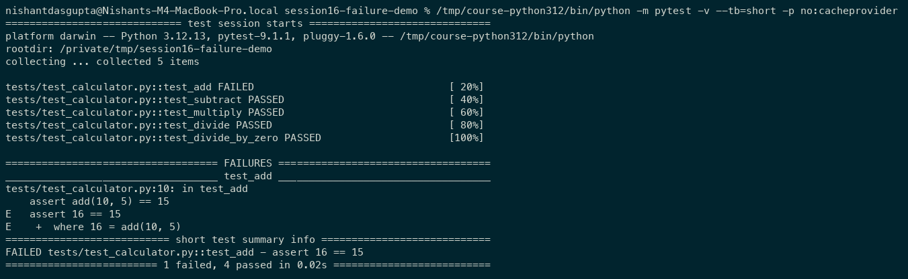

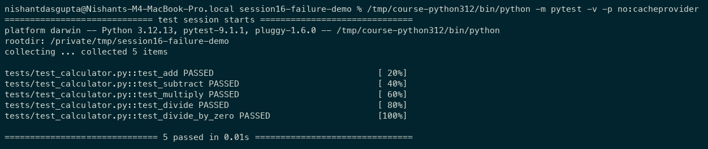

## 6. Docker

I built and ran the container from `10-final-cicd-pipeline`:

```bash
docker build -t session16-calculator:local -f ../Dockerfile .
printf '10 + 5\nquit\n' | docker run --rm -i session16-calculator:local
```

The container returned `Result: 15.0`.

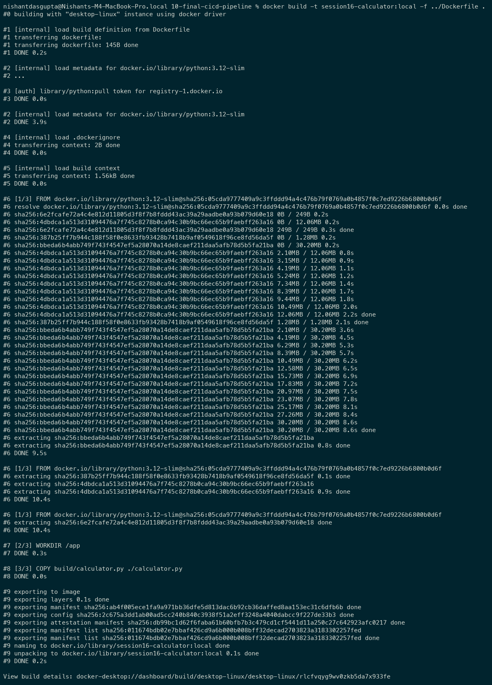

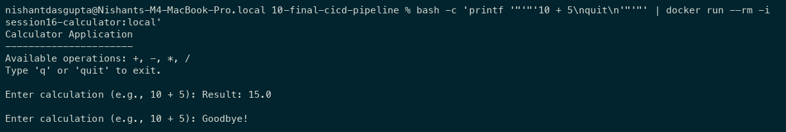

## 7. CI pipeline

[ci.yml](10-final-cicd-pipeline/.github/workflows/ci.yml) tests, builds, and checks files. The [successful run](https://github.com/NDGCodes/session16-cicd-github-actions/actions/runs/37628264295) produced `calculator-build`.

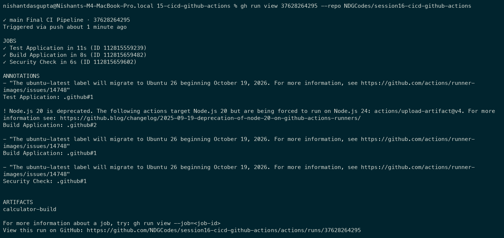

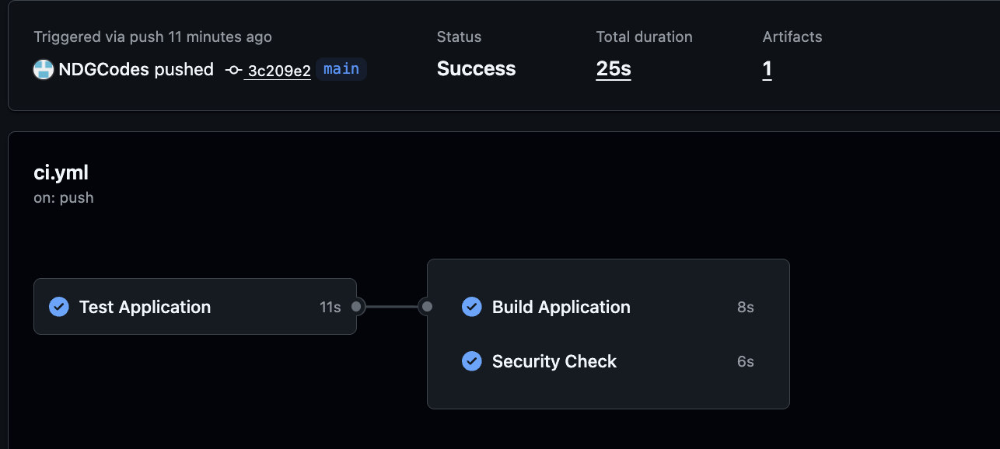

## 8. CD pipeline

[cd.yml](.github/workflows/cd.yml) packages a successful CI build into a verified Docker image. The [successful run](https://github.com/NDGCodes/session16-cicd-github-actions/actions/runs/37628322345) delivered `calculator-image` as an artifact.

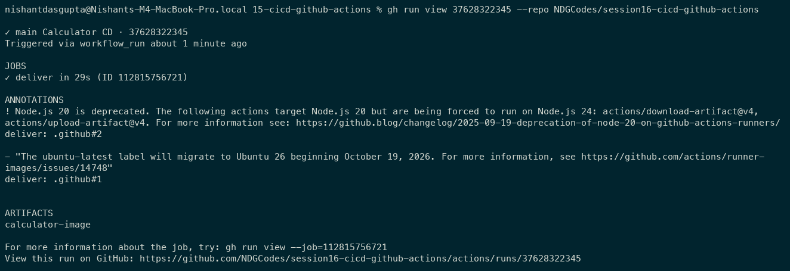

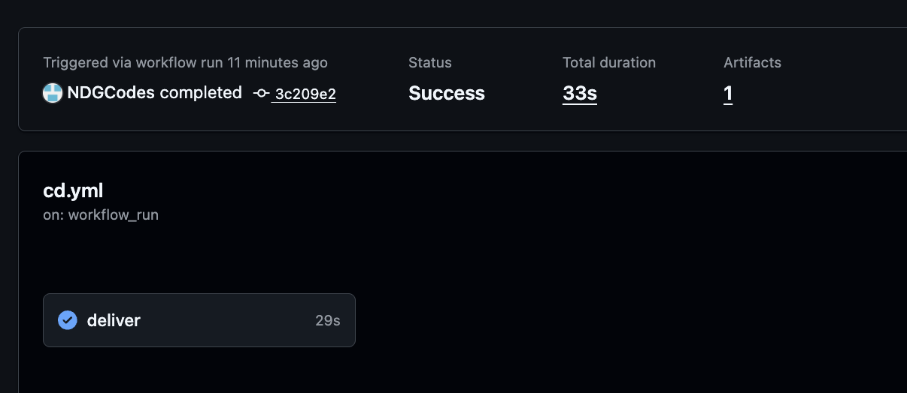

## Concepts

| Concept | Meaning |
| --- | --- |
| CI / CD | Test and build changes / deliver the verified image. |
| GitHub Actions | Runs YAML workflows on repository events. |
| Jobs / Steps | Separate tasks / commands within each task. |
| Runners | `ubuntu-latest` machines executing jobs. |
| Secrets | Automatic `GITHUB_TOKEN` accesses the CI artifact. |
| Artifacts | Saved application build and Docker image. |
