# Session 17: CI/CD & DevSecOps

Student: Nishant Dasgupta  
Roll number: **24bcs10451**

## Application and tests

```bash
pip install -r requirements-dev.txt
pytest --cov=app --cov-report=term-missing
```

All eight tests passed. The Flask application provides a web UI and API.

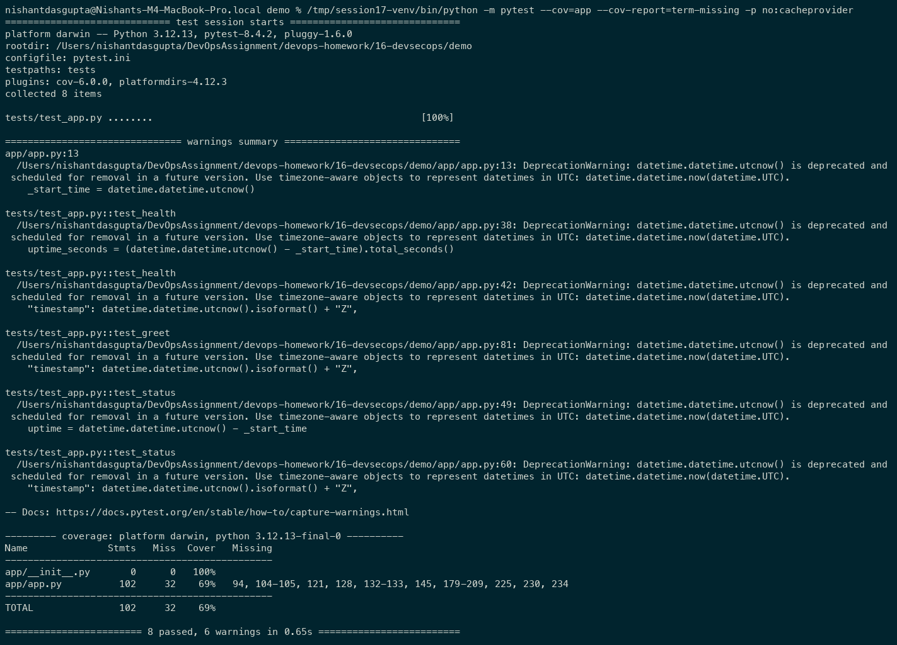

## Dependency scan

```bash
pip install pip-audit
pip-audit -r requirements.txt
```

No known dependency vulnerabilities were found.

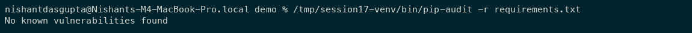

## Docker build and application

```bash
docker build -t homework-session17:local .
docker run -d --name homework-session17 -p 127.0.0.1:5002:5001 homework-session17:local
curl http://localhost:5002/api/status
```

I verified the UI at http://localhost:5002 and tested the health, greeting, and addition endpoints.

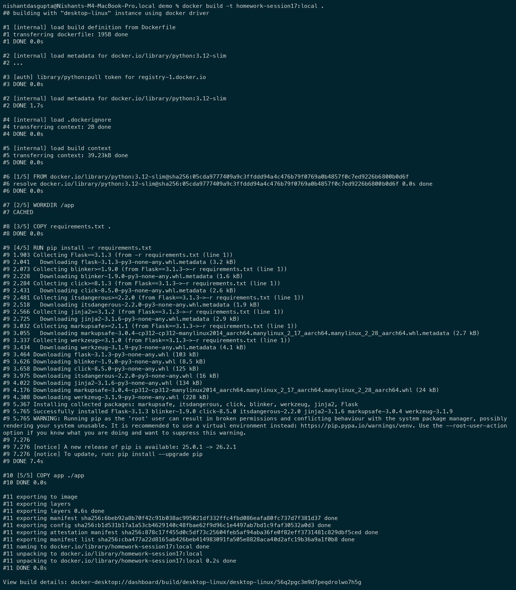

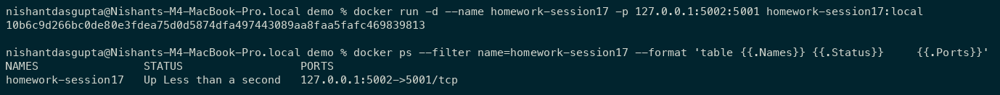

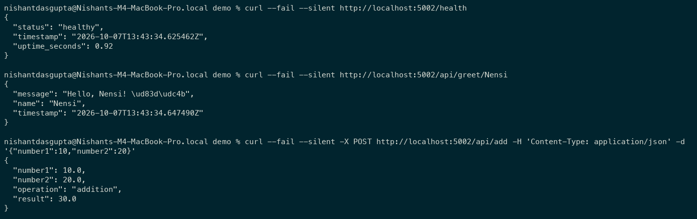

## Security configuration

[Configured workflow](.github/workflows/devsecops.yml) adds a source secret scan and a strict [Trivy policy](trivy.yaml) to the supplied workflow, using Docker Hub account `ndg007`. The strict workflow and policy are now installed in the demo repository.

CodeQL checks code, pip-audit checks dependencies, and Trivy checks secrets and image vulnerabilities. Failed checks block dependent image push and deployment jobs.

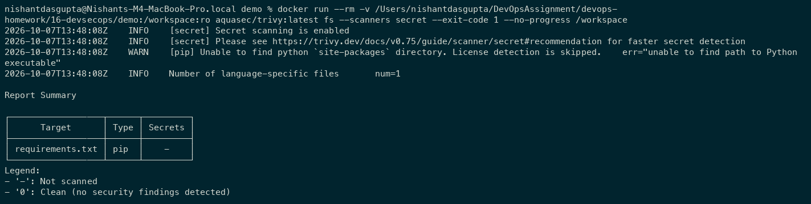

GitHub secret scanning and push protection are enabled on the [repository](https://github.com/NDGCodes/DevSecOps_Demo_CI-CD_K8s_Docker).

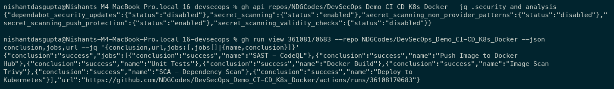

The original Debian image had **44 HIGH vulnerabilities**. The updated Alpine image passes the strict scan with **zero HIGH/CRITICAL findings**, without ignoring unfixed vulnerabilities.

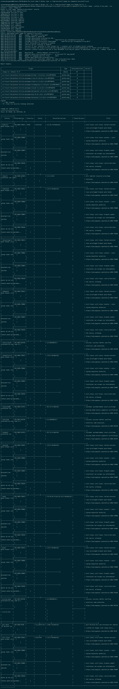

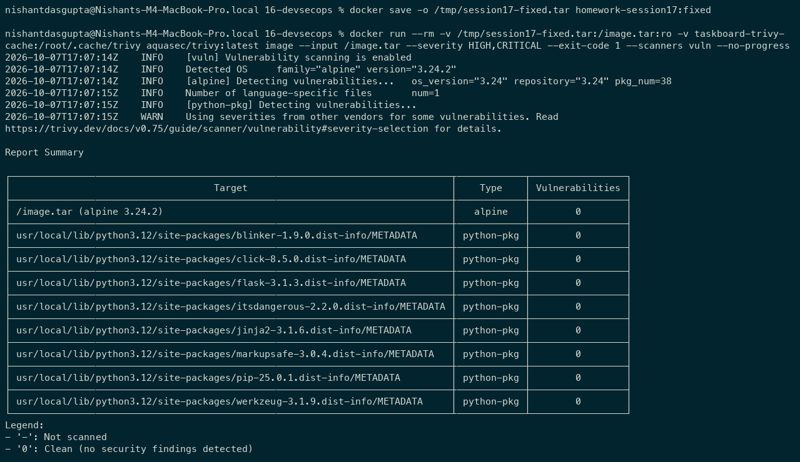

## Kubernetes

The existing deployment has two healthy pods. Rollout and the application's health endpoint were verified.

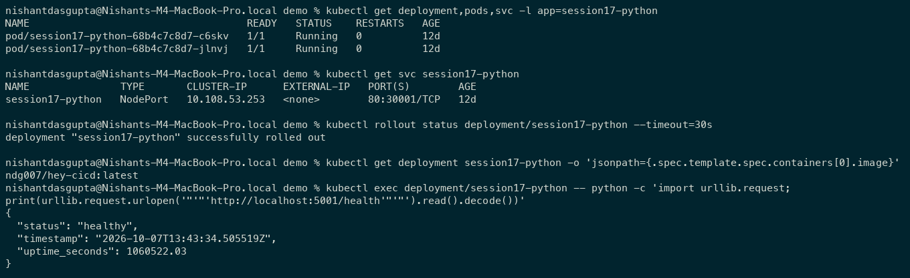

## GitHub Actions evidence

My earlier screenshots show the original workflow, whose Trivy scan reported findings without blocking the job. The strict-gate verification below shows the updated workflow.

### Failed run

CodeQL failed and downstream jobs were skipped.

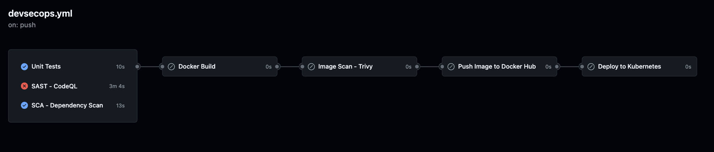

### Successful run

[Successful run](https://github.com/NDGCodes/DevSecOps_Demo_CI-CD_K8s_Docker/actions/runs/36108170683): tests -> CodeQL/SCA -> Docker build -> Trivy -> Docker Hub -> Kubernetes.

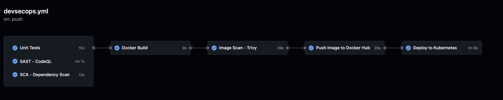

## Strict-gate verification

[Successful strict workflow](https://github.com/NDGCodes/DevSecOps_Demo_CI-CD_K8s_Docker/actions/runs/37657163670): all eight jobs passed, including strict image scanning, Docker Hub publishing, and Kubernetes deployment. No HIGH/CRITICAL findings were ignored.

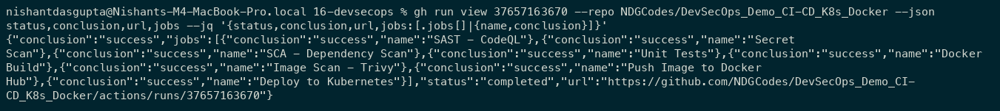

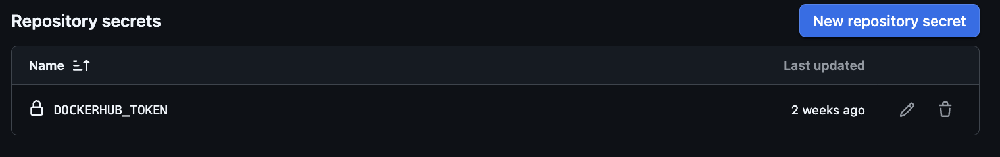

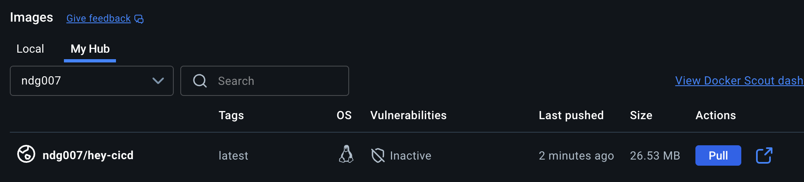

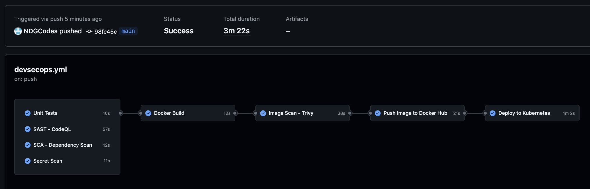
