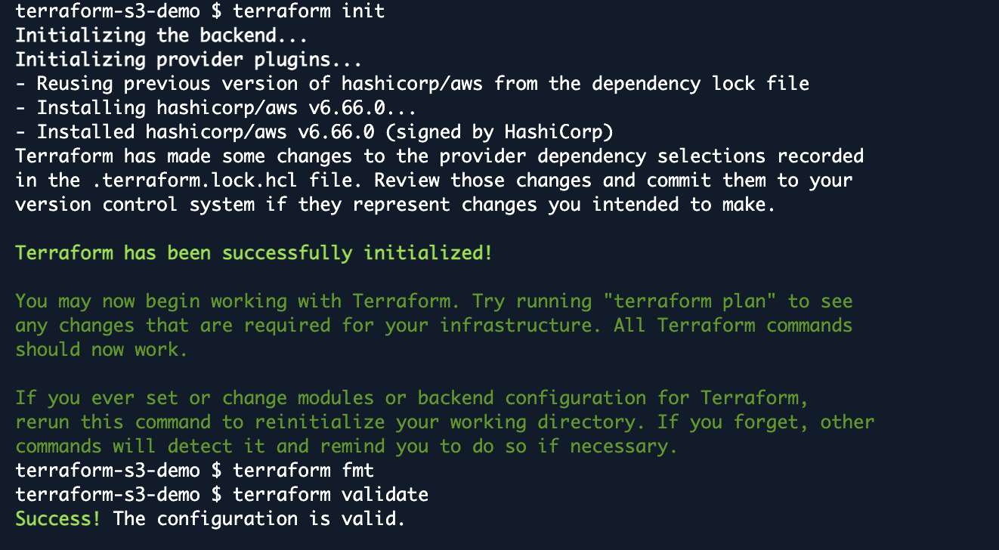
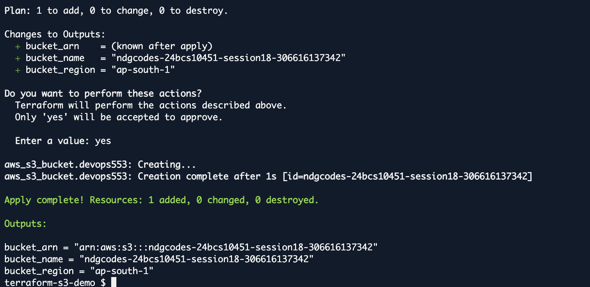
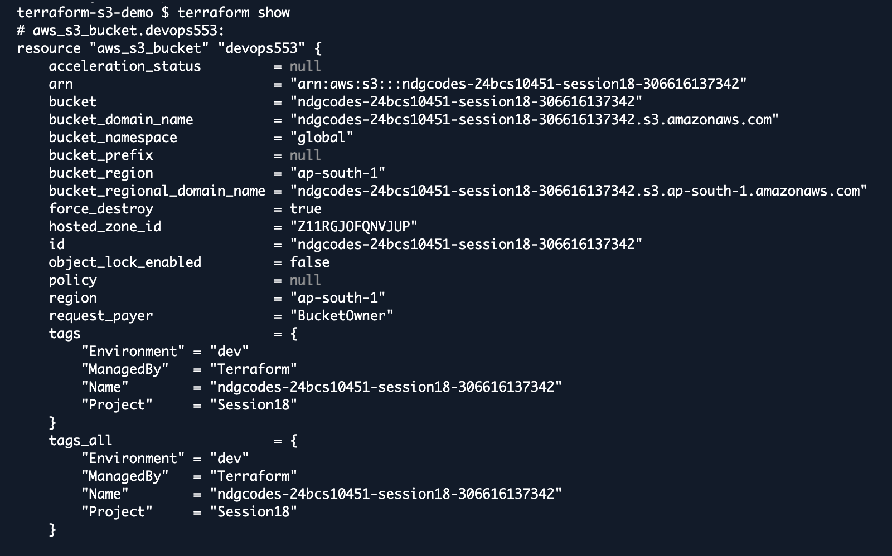
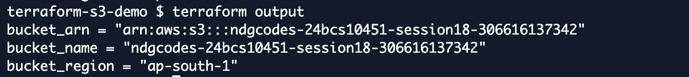
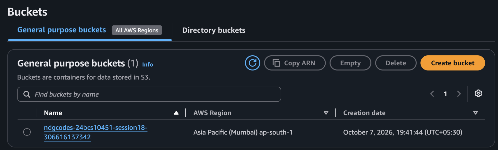
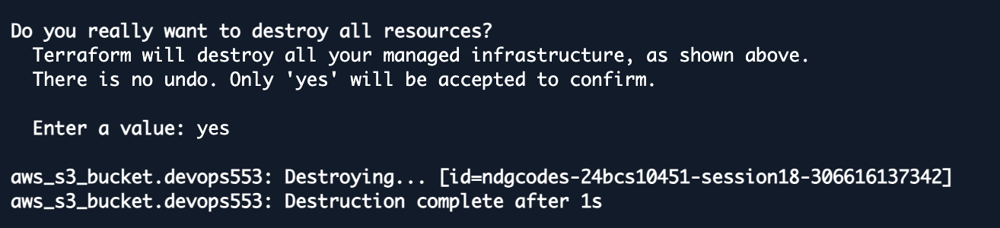

# Session 18: Terraform & Infrastructure as Code

Student: Nishant Dasgupta  
Roll number: **24bcs10451**

## Task 1: S3 demo

## Execution screenshots

Init, fmt, and validation succeeded.

The apply preview showed one resource to add; apply created the bucket successfully.

`terraform show` displays the created bucket and its tags.

Outputs show the bucket name, ARN, and Mumbai region.

The bucket was visible in the AWS S3 console.

Terraform confirmed destruction of the lab bucket.

## Task 2: AWS research

- [IAM](aws-services/01-iam/README.md)
- [EC2](aws-services/02-ec2/README.md)
- [S3](aws-services/03-s3/README.md)
- [VPC](aws-services/04-vpc/README.md)
- [DynamoDB & RDS](aws-services/05-dynamodb-rds/README.md)
