# Session 19: Cloud & Terraform in Action

Student: Nishant Dasgupta  
Roll number: **24bcs10451**

## Terraform project

## Architecture

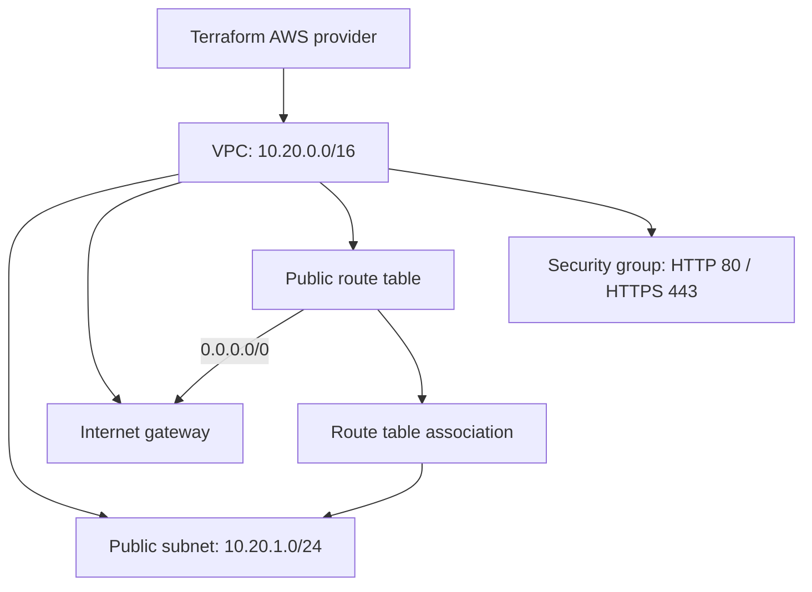

| Terraform concept | Project example |
| --- | --- |
| Provider | AWS `~> 6.0`, configured in `versions.tf`. |
| Variables | `aws_region` selects the region. |
| Resources | VPC, subnet, gateway, route table, association, security group. |
| Outputs | VPC ID/CIDR, subnet ID, and security group ID. |
| Dependencies | Resource references determine creation and deletion order. |
| State | Tracks resources in `terraform.tfstate`; inspected with `terraform state list`. |
| Commands | Plan previews changes; apply creates resources; destroy removes them. |

## AWS execution

I executed the project in AWS CloudShell, Mumbai (`ap-south-1`). Init selected AWS provider 6.67.0; validation passed and apply created all six resources.

I used the following Terraform commands:

```bash
terraform init
terraform fmt
terraform validate
terraform plan
terraform apply
terraform output
terraform state list
terraform show
terraform destroy
```

### Init, format, and validate

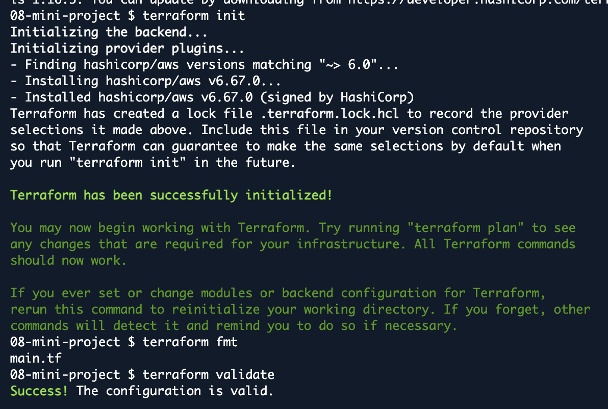

### Plan

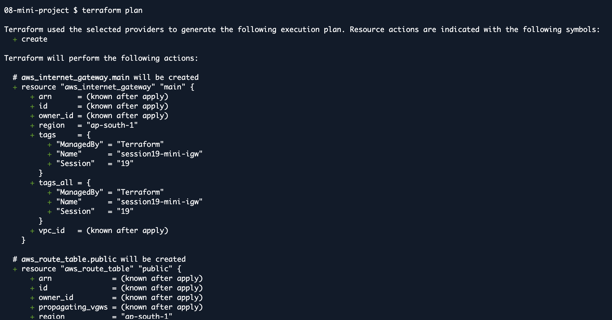

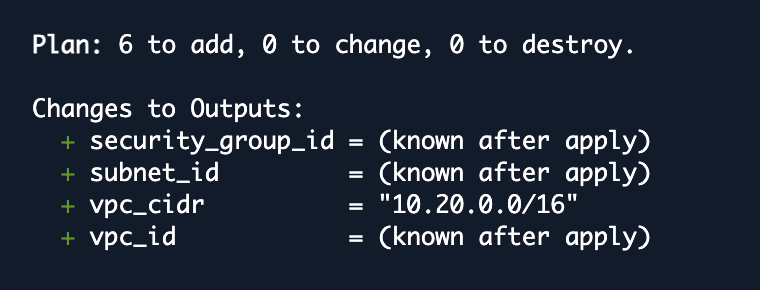

### Apply and outputs

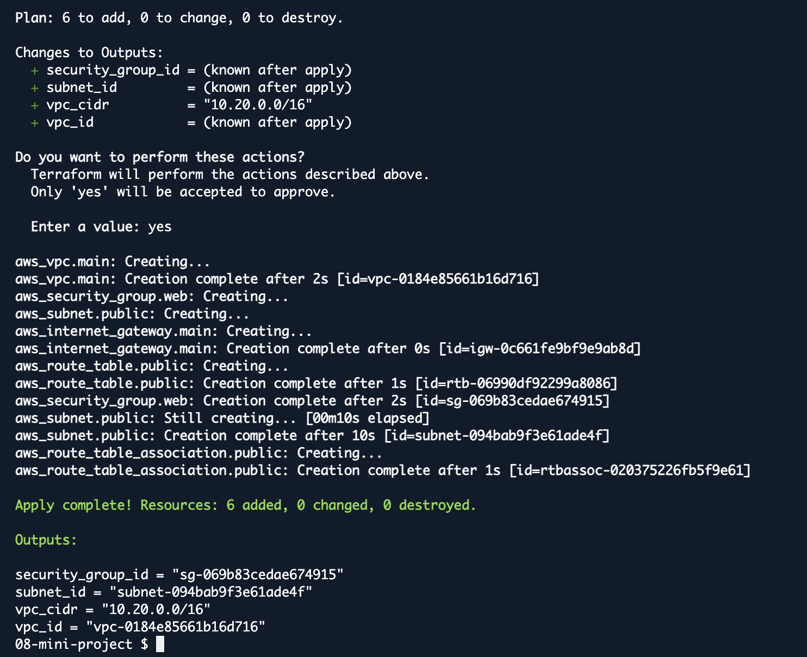

### VPC in AWS

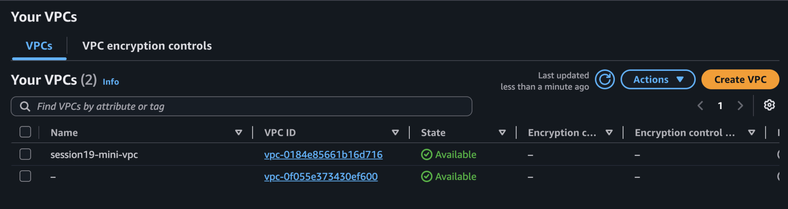

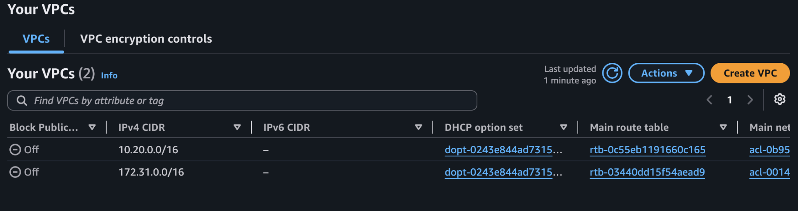

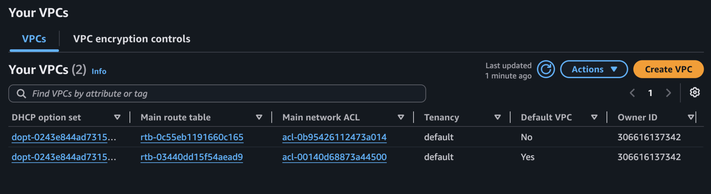

### Terraform state

All six managed resources are listed.

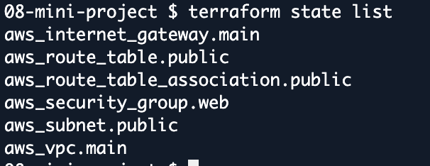

### Subnet and internet gateway

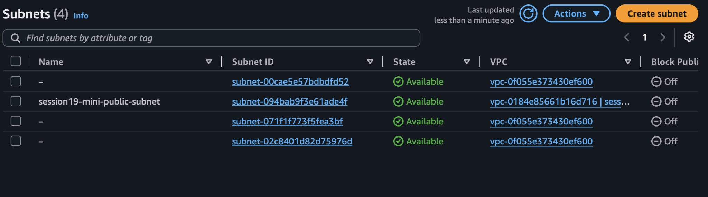

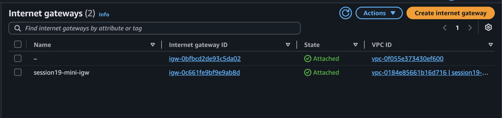

### Route table and resource map

The public route table is associated with the subnet. The resource map shows its internet gateway connection.

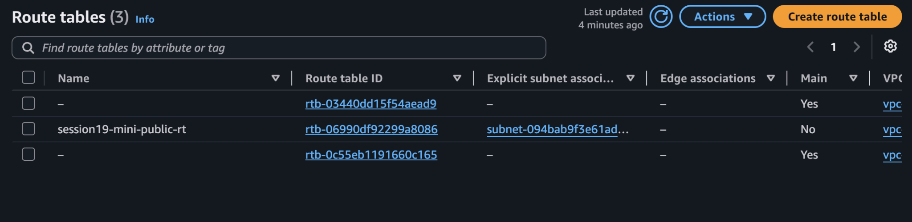

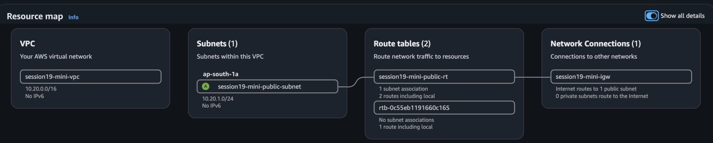

### Security group

Inbound rules allow TCP ports 80 and 443.

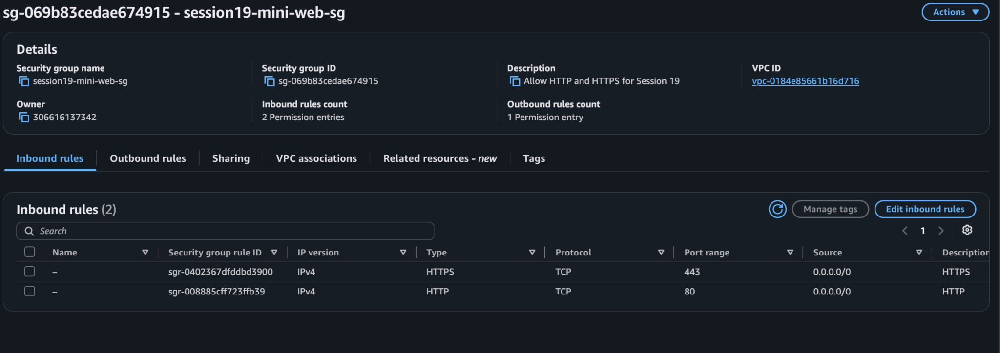

### Destroy

All six lab resources were destroyed successfully.

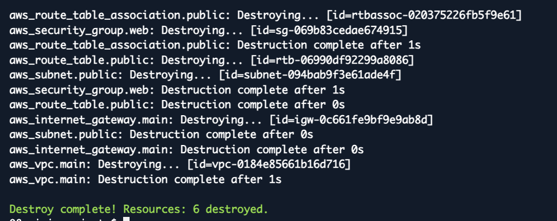
