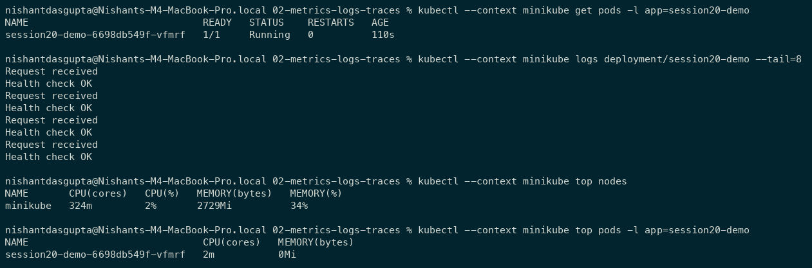
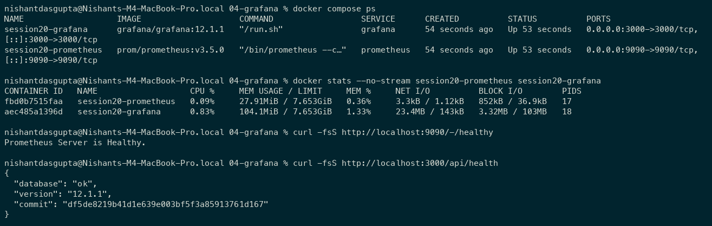
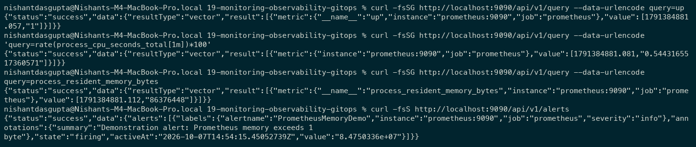
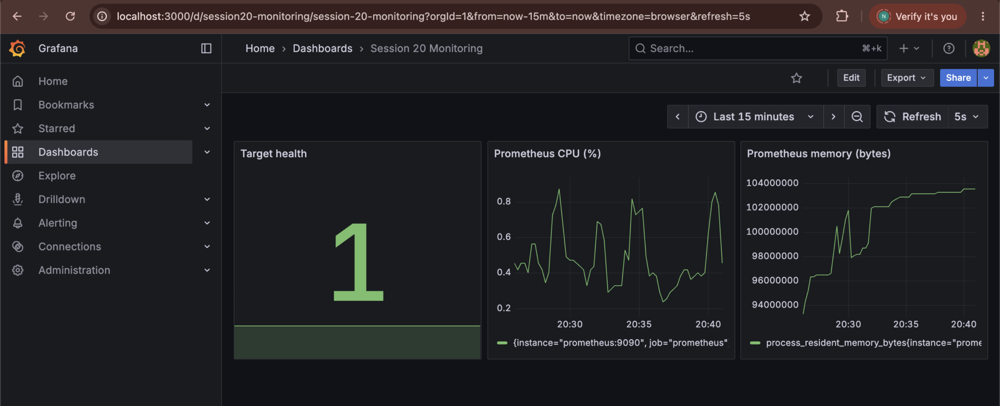
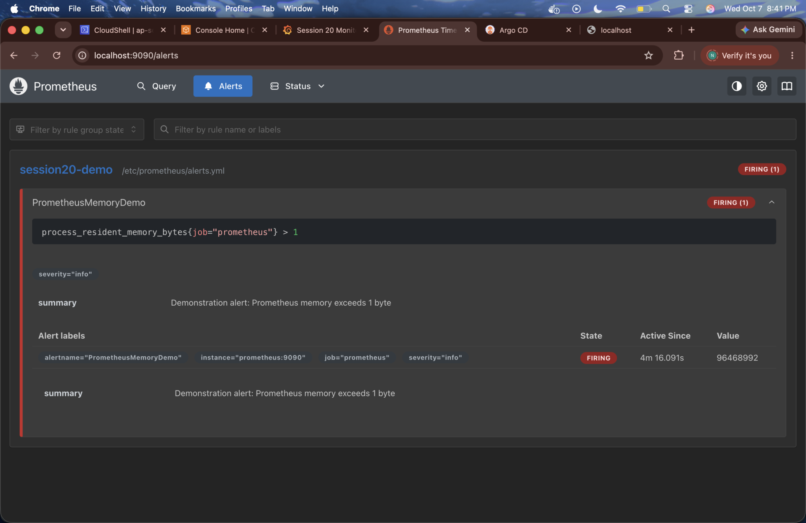
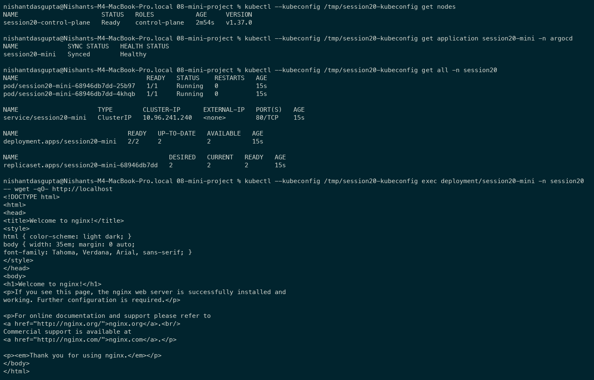
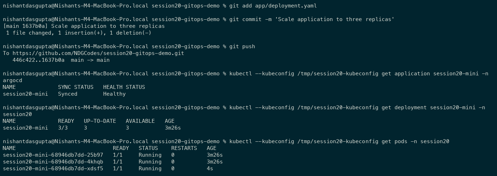
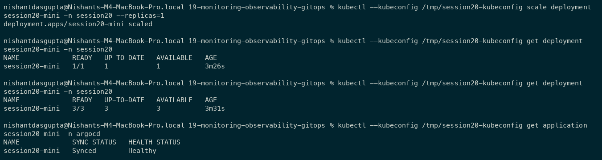
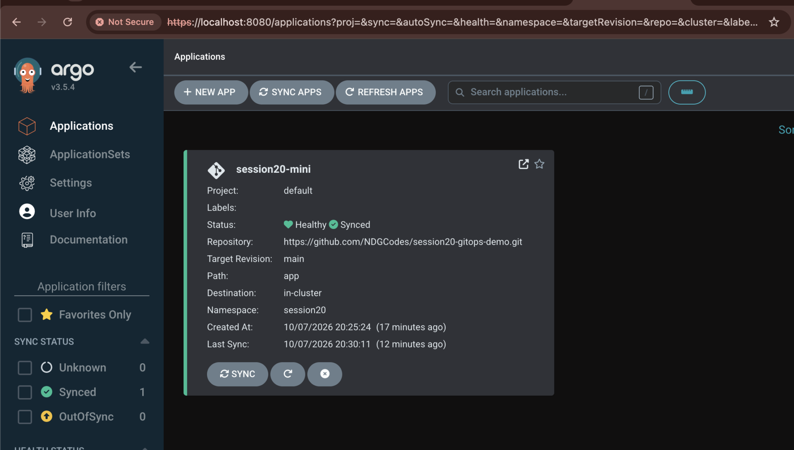
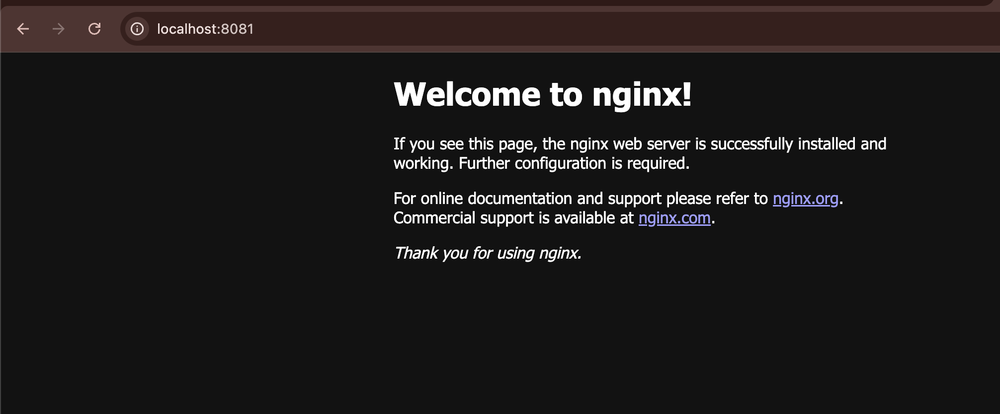

# Session 20: Monitoring, Observability & GitOps

Student: Nishant Dasgupta  
Roll number: **24bcs10451**

## Monitoring

```bash
# From 02-metrics-logs-traces
kubectl --context minikube apply -f k8s-demo/
kubectl --context minikube logs deployment/session20-demo
kubectl --context minikube top nodes
kubectl --context minikube top pods -l app=session20-demo

# From 04-grafana
docker compose up -d
docker compose ps
docker stats --no-stream session20-prometheus session20-grafana
```

CPU/memory utilization and application logs were captured from the running lab.





Prometheus queries: `up`, `rate(process_cpu_seconds_total[1m])*100`, and `process_resident_memory_bytes`. The demonstration memory alert uses a deliberately low 1-byte threshold to show a firing alert; it is not a production threshold.







Grafana dashboard: http://localhost:3000/d/session20-monitoring/session-20-monitoring. Prometheus alerts: http://localhost:9090/alerts.

I configured the Grafana Prometheus data source as `http://prometheus:9090` and used the three queries above.

## Observability

| Pillar | Meaning | Common tools |
| --- | --- | --- |
| Metrics | Numerical measurements over time, such as CPU, memory, and error rate. | Prometheus, Grafana |
| Logs | Events explaining what happened in applications and systems. | kubectl logs, Loki, Elasticsearch |
| Traces | Request paths and timing across services. | OpenTelemetry, Jaeger, Tempo |

Observability helps diagnose failures by connecting health, resource use, events, and request timing. In Kubernetes, metrics-server provides `kubectl top`; application logs and events explain workload behavior, and instrumentation provides traces. This lab demonstrates metrics and logs; traces are documented conceptually.

Sources: [OpenTelemetry signals](https://opentelemetry.io/docs/concepts/signals/), [Kubernetes resource metrics](https://kubernetes.io/docs/tasks/debug/debug-cluster/resource-metrics-pipeline/), [Prometheus alerting rules](https://prometheus.io/docs/prometheus/latest/configuration/alerting_rules/), [Argo CD guide](https://argo-cd.readthedocs.io/en/stable/getting_started/).

## GitOps mini-project

Git is the source of truth: declarative manifests describe the desired state, and Argo CD continuously reconciles Kubernetes to it. Git changes -> automatic sync -> updated pods; self-healing corrects manual drift.

[Repository](https://github.com/NDGCodes/session20-gitops-demo) contains the supplied namespace, deployment, and service. The local mini-project keeps its original two replicas; the Git demo scales to three. Only the Application repository URL was configured.

```bash
kind create cluster --name session20 --kubeconfig /tmp/session20-kubeconfig
export KUBECONFIG=/tmp/session20-kubeconfig
kubectl create namespace argocd
kubectl apply --server-side -n argocd -f https://raw.githubusercontent.com/argoproj/argo-cd/stable/manifests/install.yaml
kubectl apply -f 08-mini-project/app/argocd-application.yaml
kubectl get applications -n argocd
kubectl get all -n session20
```

The initial Git revision deployed two healthy pods.



I changed `replicas: 2` to `replicas: 3` in Git, committed, and pushed. Argo CD automatically deployed the new revision and reached 3/3 pods.



```bash
kubectl --kubeconfig /tmp/session20-kubeconfig scale deployment session20-mini -n session20 --replicas=1
```

Self-healing restored three replicas to match Git, with Synced/Healthy status.





The deployed NGINX application is accessible through the service port-forward.


